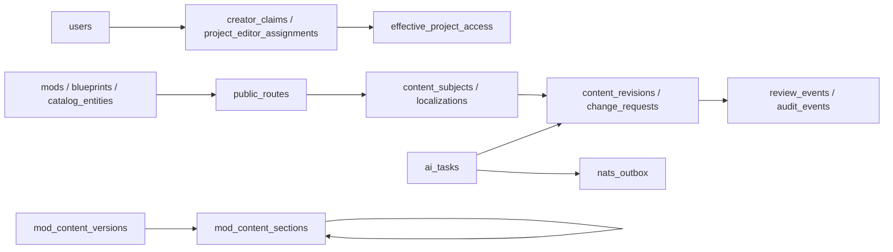

# 数据库、AI 与内容本地化审查

基线：后端 `bd50afd0ef92192c40c5152ea56e27a3fdbb657f`。本记录对应隔离工作区实际文件指纹，精确台账为 `review-backend-database.json`；不继承旧报告的已完成勾选。原分配的 64 个人工维护文件（11,509 基线行）已全部完整读取并做语义审查，另扩读目录发布服务、通知模板及本次新增代码/测试。追加25文件中本执行者完整审查16个；5个已明确交给API-A、4个交给UI-A，引用各自独立人工审查台账，不在本台账冒充本人读取；另扩读import lifecycle及新增seed/测试文件。最终覆盖按文件指纹去重由根汇总，不能把这9个转交占位记录当未审或重复计算。读取覆盖与行为验证分开登记。没有发现可核验的“约 20 项”原清单，此专项使用新证据问题 ID，不能据此声称历史问题数量为零。

## 实际数据模型与维护性

真实隔离 PostgreSQL 17 安装后为 generation 85、260 张 public 基础表、982 个索引、1376 条约束（483 条外键、472 条 CHECK、161 条 UNIQUE；包括其余主键/排他类型）；存在两个审计兼容 patch。数字内部键与公开短 ID 分离，`public_routes` 的 `(entity_type,internal_id)` 约束保护多态资源关系。大量宽业务采用领域子表、复合主键、唯一约束、status/check、JSONB 版本化快照和共享审查历史。总体关系可追溯，不能据此推断生产数据健康。

| 领域 | 主数据与关键关系 | 写入/读取与生命周期 |
| --- | --- | --- |
| 身份与权限 | users、auth_sessions、roles、permissions、user_role_bindings/user_permissions；creator_claims、team members、project editor assignments、effective_project_access | 认证入口/RBAC/作者及编辑申请；安全与授权版本分开；active/revoked、pending/approved |
| 公开资源 | mods、modpacks、simple_projects、minecraft_servers、blueprints、skin_assets → public_routes | handler/import/review → 目录/详情/下载；提交者不自动取得项目权限 |
| 全局目录 | catalog_entities → game_resources/tag/recipe_type/template/recipe；import revisions/snapshots 与 canonical definitions 分离 | import/editor→资源与合成表展示/导出；observations 与人工 canonical 不相互冒充 |
| Mod 内容 | versions → sections/templates → entry/layout/resource bindings | 导入、目录编辑与版本详情；版本作用域、树结构、未解析引用 |
| 内容审核 | content_subjects/localizations → content_revisions/change_requests → review/audit/change items | 人工或 AI snapshot、审核发布；不可变历史和可变发布投影 |
| 社区 | community_posts/related objects、comments/reactions、favorite collections/items、ratings、reports | 提交、审核、编辑、收藏与治理；角色/收件人/可见性在服务端判断 |
| 异步与派生 | ai_tasks/logs、blueprint_jobs、nats_outbox、activity/outbox/statistics、search/metrics refresh queues | 数据库为事实来源；队列唤醒、幂等派生统计与重建 |



图表示真实领域关联，不表示每条箭头都由单个外键实现。完整具体外键见 schema 文件及 `TestEveryForeignKeyHasLeadingIndex`，人工审查没有把“有索引”当成实际查询性能已证明。

主要维护风险：baseline 为生产前单次安装，不提供旧 generation 的无损升级；模型/触发器函数较大且容易出现 SQL 同名变量歧义；不可变历史表的用户 `ON DELETE SET NULL` 会与禁止 UPDATE 的触发器发生冲突，物理删号/匿名化策略需要明确产品及保留规则，不能自行删历史。公开项目/贡献/热度/search 属派生数据，应按对应函数/队列重建和核对，不能把缓存成功当成主数据提交。

## 已确认问题及修复

本专项共28个稳定ID（P1 24、P2 4），均已实现并完成表中限定范围的验证；BE-DB-014是本次实现首次回归暴露的问题，BE-DB-027是修复后管理恢复验收暴露的缺口，不把它们冒充历史清单待办。相关仓库原清单的实际数量仍由根任务跨文档核实。

| ID | 等级 | 根因/影响 | 修复与证据 |
| --- | --- | --- | --- |
| BE-DB-001 | P1 | 收藏热度函数 `user_id` 局部变量与列歧义，合法收藏写入失败 | immutable baseline 不改，前向修复变量；真实 PG 先还原原函数复现 ambiguous，再修复 INSERT/DELETE 通过 |
| BE-DB-002 | P1 | `(version_id,parent_id,ordinal)` 的 NULL 根允许重复；根 system key 同样缺口 | root partial unique；脏样本返回计数且不删数据；并发根写恰一成功 |
| BE-DB-003 | P1 | section 仅检查父节点深度，重新挂接祖先可形成循环 | advisory lock + 祖先路径/cycle 检查；串行和双事务相互挂接拒绝循环，保持既有深度规则 |
| BE-DB-004 | P1 | AI 先 completed 后落库，通知落库错误被忽略，取消迟到写 | completed 与成功持久化同事务；所有三类持久化锁任务 running，PG cancel-first/publish-first验证3.923s；真实 PG 取消/用量与跨代理通知、社区回归 |
| BE-DB-005 | P1 | 源版本之外缺目标版本/人工保护；待审核后源或人工变更仍可批准覆盖 | 入队目标快照、worker/source+target 锁、资源状态 FOR SHARE 阻止治理并发变更、最终发布重新验证；PG 正常/源变/人工变/AI变/取消/隐藏六场景 |
| BE-DB-006 | P1 | 全局额度、费用和并发配置原未实施；错误/取消用量丢失或释放未知费用 | UTC site 请求/token/cost 事务预留，保守未知使用，取消运行后 usage 保留；8 并发额度恰两成功，成本上限及缺价拒绝 |
| BE-DB-007 | P1 | 内容/通知/社区入口提交后直接 publish 绕过事务 Outbox | 三入口调用 shared enqueue helper，预算与 Outbox 同事务；PG 检查 reservation + 一行 Outbox |
| BE-DB-008 | P1 | running worker 崩溃后永久滞留，无管理恢复 | 每 15 秒扫描、按任务类型并发、超时保守 failed；新增受权限控制 retry/cancel 及 UI；崩溃状态真实 PG 验证 |
| BE-DB-009 | P1 | 任意解释/重复 JSON/缺条目/空值/变量损坏/截断被当译文，错误正文可泄密 | 完整 JSON/字段/条目/保护片段及 finish reason 校验；响应大小、URL结构和错误正文脱敏；确定性 HTTP mock 回归 |
| BE-DB-010 | P1 | 公开 GET 忽略自动翻译开关，失败版本刷新反复调用；数值 ID 跨类型锁 key 冲突 | 遵守 enabled、失败/取消自动任务去重；type+publicID 构成 key；真实PG/公开HTTP GET+本地供应商回归2项5子场景 PASS5.536s：关闭0task/0call、24并发1task、503/取消同版不重付、revision2可重建、mod/tag同数字ID隔离、2请求预算控制多语言刷新 |
| BE-DB-011 | P1 | 每次启动覆盖人工封禁文案/排序、许可证转载政策 | 种子只补缺失；PG 管理员自定义后重复 seed 保留；新 about 默认正文真实换行 |
| BE-DB-012 | P1 | 默认账号启动恢复 active/allow、重设密码导致 session 失效 | 只初始化缺失数据和未初始化 active admin 密码；保留封禁、显式 deny、可登录密码；autobot 仍禁止交互登录；PG 双次 seed 通过 |
| BE-DB-013 | P2 | 通知按 map 顺序反复插值用户值，花括号导致误报或递归替换；英文复制到目标 key 冒充翻译 | 一次源模板替换、参数白名单；真实 zh/en 默认及诚实 fallback locale；覆盖所有支持语言的渲染测试 |
| BE-DB-014 | P1 | 新并发领取持 tx 再从 pool 读配置导致小连接池死锁 | 首次真实 8 并发回归 FAIL90s；改为同 tx 读取、review config 接受既有 query 接口，最新 PASS，无放宽超时 |
| BE-DB-015 | P1 | 同批 source 失效先删 AI target，使人工修订 provenance/修订号丢失；相同文案也触发重译 | 全部旧值先锁读，未变值跳过，批量人工写后再失效旧AI；PG target rev4→5、human_corrected、旧AI失效验证 |
| BE-DB-017 | P1 | admin retry 新任务沿用创建者但绕过其日额度 | 现有 uncached RBAC + same tx user quota；PG 429不写入/剩余额度201/重复不再创建 |
| BE-DB-018 | P2 | 术语表配置未进入请求且无上下文指纹；其他scope静默无效 | 限长冻结术语+SHA256去重，prompt仅发授权翻译字段；配置/执行拒绝未定义scope；mock及PG回归 |
| BE-DB-016 | P1 | 蓝图 worker 崩溃没有租约/fence 结构支撑 | 独立兼容 patch 增 run_token/heartbeat；worker 心跳/迟到fence/删除保护由 API-B 实现，真实PG崩溃/迟到/删除2项测试PASS；独立回归证据在其专项 |
| BE-DB-019 | P1 | 公开资产查询未检查来源模组审批和导入状态，待审图标/背景可被公开读取 | 公开资产加入已审核来源/active及ready-partial条件；真实PG pending404、approved进入MIME415，未调用真实OSS |
| BE-DB-020 | P1 | 项目更新通知失败事务回滚attempt，永久重复错误且进度无法终止 | 失败在独立条件写持久递增attempt并最多8次；模板读取复用tx，行流错误拒绝；真实PG8次坏模板无通知/无收件进度推进 |
| BE-DB-021 | P1 | 统计队列旧领取在重领后仍能写派生投影和清理新任务 | 重建同tx锁对应attempt/locked状态，旧领取不执行；真实PG旧计数保持999、新领取重建0并完成 |
| BE-DB-022 | P1 | 种子同步AI绕过ai_tasks/global费用与并发，固定租约缺心跳/fence，译文只存未消费metadata且candidate日限额并发越界 | 统一普通AI任务/哈希与有界术语快照；site+crawler事务预留/Outbox，随机租约/心跳/派生写fence；标准localizations及Mod AI谱系；保留当日legacy known/unknown事实；候选日额度和领取同tx；真实PG/HTTP/race并发、预算、503未知、失主、真实自动提交与旧费用幂等通过 |
| BE-DB-023 | P1 | PNG尺寸仅完整Decode后检查，小编码大IHDR可先分配超限像素内存 | base64长度前检及DecodeConfig尺寸前检，再完整解码；合法CRC超大IHDR和编码长度回归通过，不危险执行旧版巨额分配 |
| BE-DB-024 | P1 | active公开revision未检查父模组审核与ready/partial状态 | 公开入口严格审核；合法项目编辑者私人预览保留且private/no-store；行流错误500；真实PG pending拒绝、授权预览、approved公开、rejected再拒绝 |
| BE-DB-025 | P2 | 项目图标DB错误先被空值判断当404，故障被伪装资源不存在 | 错误先返回500，真正无资源仍404；真实独占PG关闭单独连接池回归500 |
| BE-DB-026 | P1 | catalog importer失主旧token仍能更新包并DELETE新worker staging | 网络ctx绑定job/token，每个业务短TX锁当前有效job/token状态后动作，刷新clock心跳；DB故障/失主取消，当前token清全部旧staging而旧worker不能执行；真实PG/race旧token清理拒绝/当前写/取消拒绝 |
| BE-DB-027 | P2 | 种子run完成后失败翻译的后台retry拒绝，已有草稿恢复链断开；初版cleanup错误未补偿可滞留恢复run | 现有retry新建专用随机run/lease；原actor/site/crawler额度+真实source/draft绑定/hash/timestamp CAS，已有目标保护，只追加原草稿语言且不自动公开；原run费用保留。真实PG/HTTP/race19恢复场景，含8重复worker、12迟到、legacy/预算/unknown和cleanup故障扫描修复 |
| BE-DB-028 | P1 | AI管理配置读取/解密失败返回defaults假成功，PUT保留secret从defaults取空会覆盖不可读设置 | checked管理GET/PUT返回503 AI_CONFIG_UNAVAILABLE且不写；缺row停用默认保持；真实PG红绿4场景证明坏envelope/JSON此前PUT200覆盖，关pool错误不被假200隐藏 |

## 模块、角色与体验闭环

| 模块/实际角色 | 入口、持久化及回馈 | 已补全与验证边界 |
| --- | --- | --- |
| 访客公开目录 | content GET → locale fallback → optional task → 已发布本地化 | enabled 开关生效、失败同版本不重复收费；真实公开HTTP GET/PG/供应商mock动态验收，实际浏览器由根任务汇总 |
| 普通用户内容/通知/社区翻译 | 既有 content.translate/notification.translate 与每日权限 → quota/Outbox → 轮询 | 快照与归属检查、过期/删除拒绝、失败可恢复；社区/通知角色测试见API-A/B专项 |
| 目录编辑者/资源owner | localization editor → revision/review → 公布 | skin owner bypass仅已授权入口；人工保护、未变语言保持历史、同批变更PG验证 |
| 内容审核员 | 待审核 AI revision → 审核发布 | 审核时再核源/目标，无法批准覆盖较新人工输入，6种PG场景 |
| AI管理员 | admin task list/config → retry/cancel → 新task/终态 | 有权限的恢复按钮与费用提示由前端UI-A接入；原actor日额度与cancel/publish竞争PG验证，浏览器由根汇总 |
| 种子管理员/服务账号 | seed config/run → 独占candidate/daily slot → metadata → AI → 可编辑草稿/正常审核提交 | 实际任务/费用/源文/run fence闭环，Mod AI谱系、失败草稿保留及completed run显式恢复到原草稿；源/人工CAS保护与三类预算；simple无谱系字段不假称等价，真实Modrinth链未调用 |
| 通知模板管理员 | template config → recipient locale render → immutable stored notification | 不递归解释用户值；真实zh/en与实际fallback语言、已有多语保留；本专项单元渲染验证 |

## 测试库验证与实际运行证据

测试环境为本任务创建的回环 PostgreSQL 17 专用 cluster。源环境变量文件权限 0600、随机测试密钥，不复制连接串。Go 初次 1.26.5、最终安全更新至 1.26.8，路径由根任务提供。AI 集成每个测试自行创建随机数据库，创建时写唯一 ownership COMMENT，清理时核对所有权；无生产连接和真实用户数据。

| 检查 | 结果 | 范围 |
| --- | --- | --- |
| 空库 `Migrate`、种子、重复 `Migrate` | PASS | generation85，260基础表/483外键，2patch ledger |
| 修复前85函数/脏根旧数据样本 → patch | PASS | 原收藏歧义复现；脏根不清洗；干净同 generation 扩展；并发重复启动只登记一次 |
| DB4回归+默认账号保护回归 | PASS | `go test ./internal/database -run 'TestSchemaRepair\|TestFavoriteBaseline\|TestGovernanceSeeds\|TestDefaultUserSeeds' -count=1 -v`；最终记录 1.076s，含蓝图patch后的回归 |
| AI领取/额度/恢复/费用/审核 | PASS | 首次死锁 FAIL 已修复；并发/barrier测试夹具错误另记录，修后不改变核心断言；最终主范围 13.130s；追加原actor日额度/术语/无效scope/治理锁回归 12.818s；原子发布与取消回归 3.923s |
| 根唯一/祖先循环/四并发 Migrate | PASS | `TestSchemaRepairConcurrentRootsCyclesAndRepeatedMigrateIntegration` 最终主范围已含两patch再验证 |
| 确定性 HTTP / 通知模板 | PASS | 200/timeout/429/503/截断/JSON/变量/URL及模板 literal/fallback，最新 fallback目标0.449s |
| 追加目录/seed/统计/通知回归 | PASS | `go test -race ./internal/httpapi -run` 11项精确选择（函数见对应测试文件）；14.134s，seed费用known/unknown/幂等、真实自动提交、8并发候选额度/重复领取、失主结果、旧importer清理、图标审批、PNG分配前检查；曾有fixture错误/mapper真实断链已修复，失败记录保留 |
| 公开 GET 自动翻译补验（BE-DB-010） | PASS | `go test -race ./internal/httpapi -run '^TestAIPublicContentGET' -count=1 -v`；2顶层/5子场景、345次实际GoHTTP公开GET、受控provider6次请求，5.536s；docs/audit/evidence/ai-public-get.json及/tmp/mcmods-ai-public-get-first-race.log；每顶层随机ownedPG，API/SQL/Outbox/worker实际执行，无真实AI费用。Outbox由测试显式实际worker消费，不假称NATS实际投递或所有server middleware已验 |
| 本专项最终 AI/seed/模板完整选择 | PASS | fresh PG17.11，Go1.26.8；精确选择命令见下方；30个顶层测试/60子case节点；43.650s，日志 /tmp/mcmods-seed-recovery-final2-race.log；含Core失败9场景与新增AI管理4/恢复19场景。随后只加强恢复3字段fixture，两新增group（恢复19、配置4子场景）最终 -race PASS6.018s，/tmp/mcmods-seed-recovery-final3-race.log |
| 高风险失败场景扩验（Core代理） | PASS | `ai_failure_scenarios_integration_test.go`，真实独占PG+受控HTTP 3组9叶，-race 14.342s；断连/1秒超时/外部取消恢复零自动二次调用、坏批次整体不发布保留旧target及已知usage、执行前模型停用零请求；其自有台账非本人假继承 |
| 生产数据与运行健康 | NOT_RUN | 未取膨胀、锁/连接压力、实际容量、备份恢复、维护/复制数据；不要求生产权限作为本任务前置 |
| 代表性查询执行计划 | PASS | PG17.11 owned库，1万mods（90%approved）和1万activity，EXPLAIN ANALYZE真实执行并事务回滚；见 evidence/query-plans.json，测试12.144s |
| 高负载/长期运行 | NOT_RUN | 单样本与局部DTO投影不能推断生产容量，没有伪造性能百分比 |
| Typesense 实际引擎（根执行） | PASS | 30.2引擎，`go test -race -count=1 ./internal/searchindex`；`TestTypesenseRealCollectionImportAliasFilterAndDeleteIntegration`1.339s验证collection/schema/alias、2合成文档approved过滤与facet/internal_id排序、ready门、坏字段拒绝、不假ack、delete；不含完整backend worker重建或生产索引；证据/tmp/mcmods-typesense-real-integration.log |
| 真实 AI 供应商 | NOT_RUN | 无费用/数据外发授权，真实连通性、质量、账单未验证 |

本专项最终选择命令（先加载项目文档约定的独占测试环境，不在命令中写密钥）：

```sh
go test -race ./internal/httpapi -run '^(TestSeedCompletedRunAdminRecoveryDraftCASIntegration|TestSeedCrawlerAITaskLedgerAndFencing|TestSeedCrawlerLegacyUsageIsPreservedBeforeProjectionReplacement|TestSeedCrawlerCandidateClaimSerializesDailySlots|TestAI.*|Test.*NotificationTemplate.*)$' -count=1 -v
go test -race ./internal/httpapi -run '^(TestSeedCompletedRunAdminRecoveryDraftCASIntegration|TestAIAdminConfigurationReadFailureDoesNotOverwriteIntegration)$' -count=1 -v
go test -race ./internal/httpapi -run '^TestAIPublicContentGET' -count=1 -v
```

代表性执行计划只证明该数据分布和局部查询：活动用户页使用 `idx_activity_user_time` Index Scan、50行、0.056ms；目录 count/updated 页扫描9000行、过滤1000行、约10.942/11.839ms，排序top-N。选择计划符合90%命中样本，不据此增加或删除索引，不将它写成生产性能优化百分比。真实查询过滤复用 `publicModCatalogFilter`；证据由根任务隔离测试取得。

最终统一 `go test ./...`、vet、race、build、依赖检查和跨仓库浏览器证据由根任务环境记录汇总，不凭本专项摘要宣称全绿。真实数据库集成不会替换成 SQLite/mock。

## 部署、恢复与未完成边界

正常 `Migrate` 保留 generation85与业务数据，patch 使用已有 migration advisory lock +事务。唯一约束前检查脏数据计数；有脏数据时需拥有真实数据授权的负责人决定恢复/整改，不能自动删除。索引/表锁的大表影响未验证，需要真实维护窗口评估。蓝图旧 worker 必须先停，执行 repair 后启用新 fenced worker；旧/新并行不能宣称安全。兼容新增对象可保留，失败事务回滚，无破坏性 down。

种子和导入旧worker先停再启新worker，避免旧进程继续直接付费或无fence写staging。种子不新增schema；先停旧AI/seed worker再启新版本，恢复run不与旧调度共用。新草稿保存时绑定draftPublicId；旧缺绑定只按严格原run时间/归属证据兼容，否则409，不猜测新草稿。当日仍存在的旧translation投影在覆盖前幂等保存为legacy-unverified AI事实，已知usage与估算预留分列、未知费用保守停止新调用；历史已经覆盖的旧请求无法恢复，生产供应商账单不由此验证。

正式行为、预算、接口及供应商边界见 `../AI_TRANSLATION_RELIABILITY.md`、`../../DEVELOPMENT_SCHEMA_RESET.md`、`../../SYSTEM_NOTIFICATION_LOCALIZATION.md`、`../../SEED_CRAWLER_DESIGN.md`、`../../CONTENT_EXPORT_VISIBILITY.md`、`../CONTENT_STATISTICS_RELIABILITY.md`、`../../PROJECT_FOLLOW_NOTIFICATIONS.md`。

未完成和需决策分别记录：

- **边界已收紧**：非 site/default quota 配置与执行明确拒绝，未定义的用户/角色预算不再静默失效；管理员retry重新应用原actor日额度并已真实PG验证；术语表冻结文本/指纹且限定长度，已进入prompt/去重。AI静态源文的最终数据库版本不可验证（前端保护人工输入），不得写成全类型数据库双版本保护。
- **测试边界**：断连、超时、调用者取消、五种坏批次、模型停用执行拒绝已有真实PG+HTTP -race证据；不存在逐语言enabled字段，语言停用竞态不适用。长时间多实例/NATS与供应商崩溃窗口、高负载长期行为未验证；最小解除条件为有界隔离多实例故障夹具，不需要生产数据或真实AI。
- **已实现恢复边界**：completed旧run的失败译文经显式retry创建独立恢复身份，回写既有绑定草稿、source/draft CAS与人工目标保护；19真实PG/HTTP场景已验证。草稿删/过期/已提交、源文变化、历史绑定无法证实或已有目标仍返回409，需要沿已有草稿人工编辑处理；不恢复公开资源、不自动重付费。
- **产品/权限决策**：跨用户相同译文合并任务的额度归属、私有内容外发授权、物理删号与不可变审计匿名化、真实语种模板人工质量、旧generation无损迁移方案。
- **部署边界**：统一提供方客户端允许显式 loopback，生产环境的管理员权限、HTTP代理与本地服务隔离尚未全验收；相关私网/同源重定向改进属于 API-A 跨链审查。真实供应商只计费一次无法由本地任务幂等保证。

新增回归过程保留：恢复初版查询少SQL参数失败后修正；generic fixture最初使用错误taskType而400不能证明scope gate，修正为真实类型并断言fenced错误后通过。管理配置红测首轮缺合法actor使PUT外键失败，补真实actor后的红测明确复现200覆盖（/tmp/mcmods-ai-config-read-red-real-actor.log），修复后503并逐值确认未覆盖。施工中undefined helper编译失败记录与业务测试失败分开，不冒称已运行用例。cleanup故障用owned测试触发器实际拒绝一次终态更新，移除后即使nilNATS Start仍由既有scan收敛failed，不新增外部请求。

BE-DB-010此次仅补足既有修复的动态回归，不改变业务source。请求经实际Go HTTP method/path/optionalAuth及公开handler，supplier为受控端点，独占PostgreSQL、事务预算、Outbox和翻译worker保持真实。原始baseline与当前共享事务/任务helper签名不同，本次没有回退共享业务代码造红测，不宣称这一新增测试已在旧baseline红绿复现；现行行为全部实际通过。
