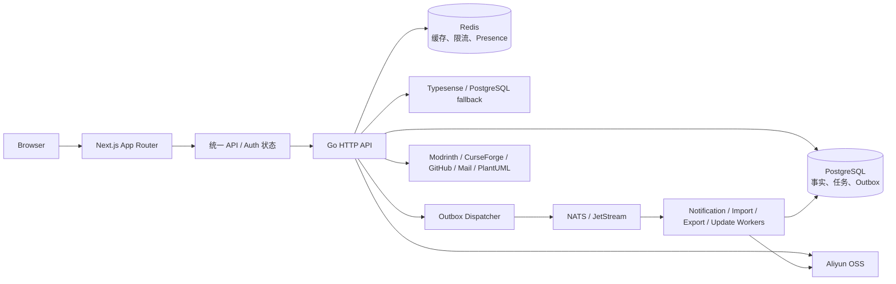
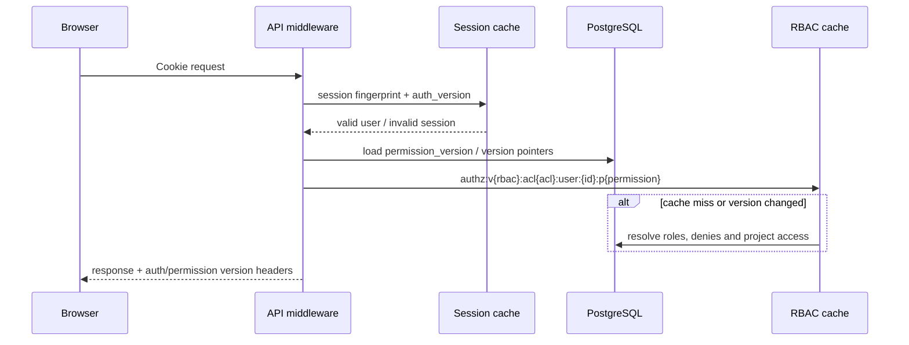
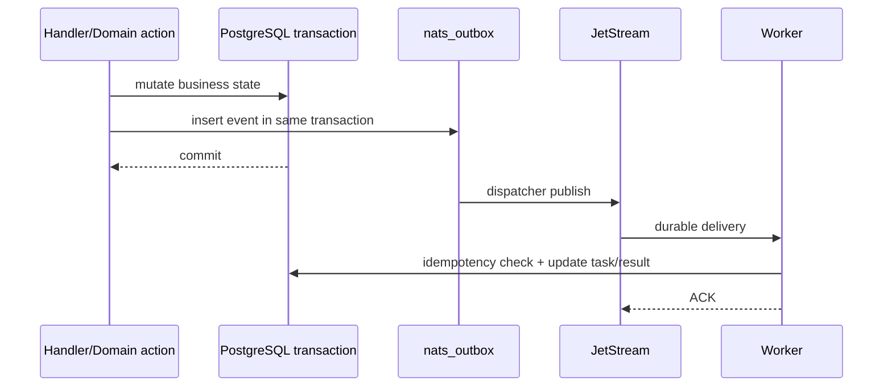

# 架构与模块关系

## 总体结构



PostgreSQL 是业务状态、异步任务和 Outbox 的事实来源。Redis 用于缓存和分布式限流，不应成为权限事实来源。NATS 用于分发/唤醒，可靠路径依赖 JetStream 与数据库 Outbox 组合。

## 认证与授权关系

```text
session token
  -> session validity + users.auth_version
  -> authenticated user
  -> permission cache key:
     user_id + permission_version + rbac_version + project_acl_version
  -> effective permissions / project access
```

- `auth_version` 只处理密码、停用、封禁、强制退出等安全撤销。
- `permission_version` 处理用户角色和直接权限变化。
- `rbac_version` 处理全局角色定义变化。
- 项目 ACL 版本处理作者认领、团队、项目作者/团队关系等派生权限变化。

项目访问由正式编辑员关系、已审核个人作者认领、有效可授权作者关系和团队关系动态推导。资料提交者不是权限来源；后台手工 RBAC 项目角色仍作为特殊情况管理入口保留。



## 业务域与公共基础设施

| 业务域 | 权威入口/基础设施 | 主要下游 |
| --- | --- | --- |
| 项目与资料 | 项目类型注册、项目权限解析、审核系统 | 版本、文件、评论、关注、作者团队 |
| 评论 | 评论 Handler、楼层计数、Markdown 渲染 | 通知、附件、日志分享、举报 |
| 文件与 OSS | 文件记录、扫描状态、对象访问服务 | 评论附件、皮肤、日志、导出、表情 |
| 通知 | 模板注册/渲染、通知表、Outbox Worker | 审核、关注、导出、系统事件 |
| 项目自动更新 | 数据库配置、定时/队列 Worker | 项目修订、通知、审计 |
| 收藏夹导出 | 数据库任务快照、Worker、OSS | Modrinth 元数据、通知 |
| 作者/团队 | 认领、成员、项目关系 | 项目开发者权限派生 |
| 用户操作记录 | Activity 事实表、聚合和清理策略 | 后台检索、合规保留、审计 |

## 模块依赖矩阵

| 模块 | PostgreSQL | Redis | NATS | OSS | Typesense | 外部 API |
| --- | ---: | ---: | ---: | ---: | ---: | --- |
| 认证/权限 | 是 | 是 | 否 | 否 | 否 | OAuth/邮件 |
| 项目/资料 | 是 | 是 | 可选 | 是 | 是 | Modrinth/CurseForge/GitHub |
| 评论/社区 | 是 | 是 | 是 | 是 | 是 | 否 |
| 通知/私聊 | 是 | 是 | 是 | 否 | 否 | SMTP |
| 文件/日志 | 是 | 是 | 是 | 是 | 否 | 日志无第三方 AI 默认发送 |
| 收藏夹导出 | 是 | 是 | 是 | 是 | 否 | Modrinth CDN/API |
| 项目自动更新 | 是 | 是 | 是 | 可选 | 是 | 外部项目源 |
| 服务器探测 | 是 | 是 | 可选 | 否 | 否 | Minecraft Server |
| 搜索 | 是 | 是 | 可选 | 否 | 是 | Typesense |

Handler 层仍直接包含较多 SQL 和事务逻辑；没有统一强制的 Service/Repository 三层。简单 CRUD 因而避免了空转发层，但大型 Handler 已出现职责和查询集中风险。Go 包依赖由编译器约束，审计构建未发现循环导入。

## 关键异步调用链



本机 JetStream 未启用，因此上图是代码目标调用链，不代表本次已完成真实可靠性验证。

## 前端状态边界

- 登录用户状态由统一认证模块维护；统一 API 客户端读取 `X-MCMods-Auth-State` 等响应头并同步清理失效状态。
- 页面数据主要由 API 返回，URL 参数用于列表筛选。审计未发现第二套全局认证状态实现。
- API normalizer、编辑器适配和内容类型别名位于系统边界，承担运行时校验、国际化或后端协议隔离，不属于无意义映射。

## 结构性维护热点

后端多个 Handler 文件超过 1,500 行，前端 `admin-console.tsx` 超过 5,700 行。它们仍可编译且职责按函数区分，但修改冲突、局部状态耦合和审查成本较高。建议按业务面板/服务边界渐进拆分，不建议一次性大范围改名或创建万能 Service。

## 外部依赖边界

- PostgreSQL：强一致事实和版本指针。
- Redis：缓存、限流、跨实例协调；故障时关键权限回源数据库。
- NATS/JetStream：异步分发。当前本机只有 Core NATS，JetStream 未验证。
- OSS/CDN：对象存储、派生文件和临时下载。
- Modrinth/CurseForge/GitHub：外部项目与文件元数据，HTTP 客户端包含私网阻断和响应限制。
- PlantUML 公共服务：Markdown 图表内容可能离开站点，是需要明确配置和披露的隐私边界。

开发库重置命令不是无保护脚本：`cmd/db-reset`复用配置校验，只允许`APP_ENV=development`、要求`DB_RESET_ON_START=true`及与实际连接数据库名完全一致的`RESET <name>`确认，并拒绝名称含prod/production的库；`DATABASE_URL`覆盖普通DB字段时也从URL重新解析有效库名。该边界应保留。

负载观察工具只读`pg_stat_activity`，但其环境契约和输出失败语义不完整，见`OPS-021`。

## Minecraft版本同步与导出边界

Minecraft兼容目录当前以单个JSONB设置为持久事实，每个实例又独立启动北京时间04:00同步，只有进程内mutex，没有跨实例租约或配置CAS（`OPS-012`）。MRPack具体加载器版本不属于该持久事实，而由每次HTTP预检直接访问Fabric/Maven并重新选择（`ARCH-017`）；预检与创建因此也没有共享快照（`BUG-065`）。建议把外部来源同步收敛为受数据库租约保护的单一版本快照服务，公开选择器、预检和Worker都只引用同一快照代次。

## 收藏夹MRPack任务边界

收藏夹导出以PostgreSQL任务和租约为事实来源，即使队列订阅失败仍可由轮询恢复，这一总体方向正确；但任务创建限额是事务外“先计数后插入”，并发请求可以同时穿过限制（`SEC-024`）。Worker先把生成物写入OSS，再单独更新数据库任务；数据库提交失败或租约丢失会留下无法由任务生命周期追踪的对象（`OPS-013`）。此外任务对收藏夹使用 `ON DELETE CASCADE`，删除收藏夹会连同已完成报告和运行中任务一起删除，既破坏历史，也使上述对象泄漏窗口扩大（`BUG-068`）。该域需要把不可变收藏夹快照与原收藏夹生命周期解耦，并通过可补偿的对象状态机提交生成物。
## 蓝图处理链

蓝图上传从统一OSS接口创建uploading主体和原始对象，完成上传后创建normalize任务；Worker解码为内存规范文档、生成材料/封面/规范variant，再由详情接口聚合目录资源。用户还可创建convert任务生成其他格式。当前架构中上传规范化复制了任务INSERT并直接Core NATS发布，而转换/重试使用任务+Outbox权威入口（`LEGACY-013`）；任务没有租约，领取后崩溃不可恢复（`OPS-014`）；OSS衍生物和数据库状态没有补偿协议（`OPS-015`）。
