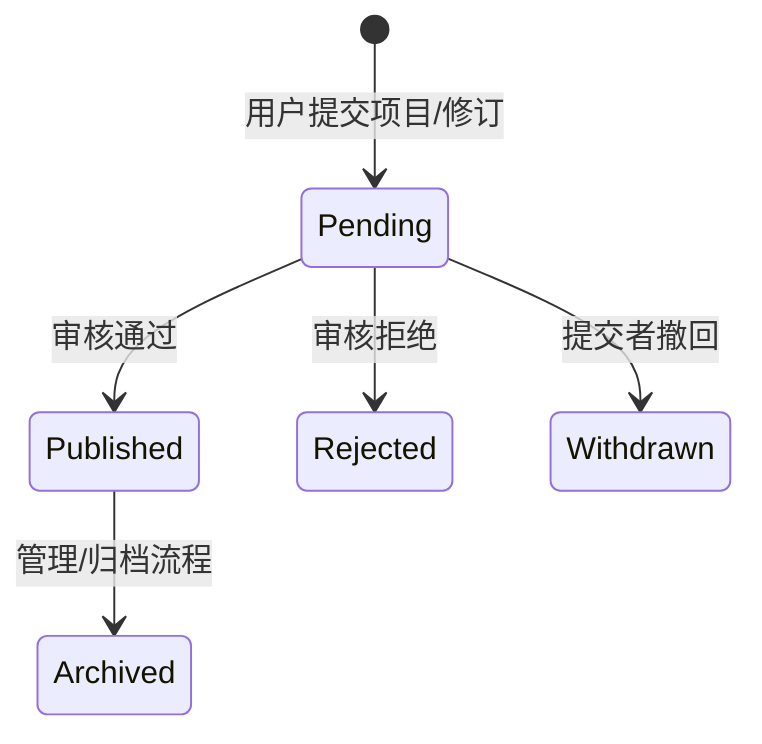
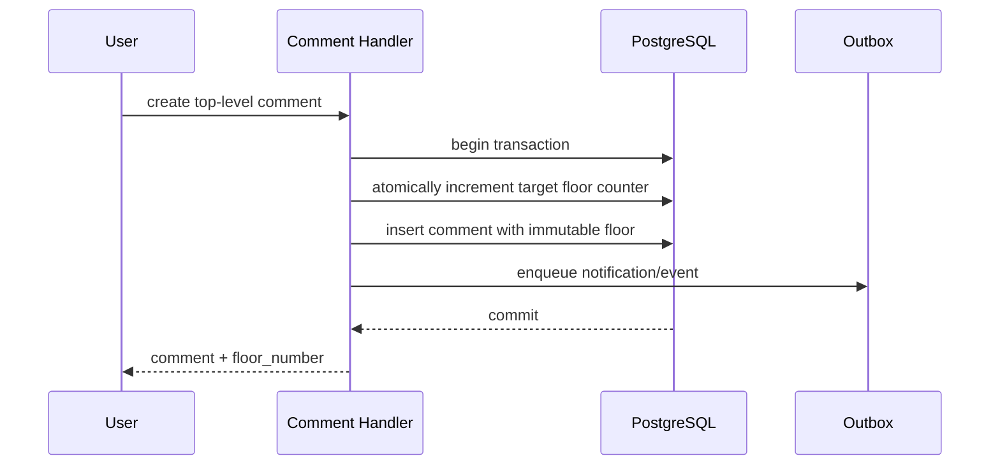

# 功能逻辑参考

本文件记录当前代码的权威行为，供前端开发和后续重构判断“应复用哪一套实现”。

## 功能实现索引

| 功能域 | 已发现的实际实现 | 主要入口/事实来源 | 本轮人工深度 |
| --- | --- | --- | --- |
| 注册、登录、登出、Session、密码/邮件、OAuth | 有 | auth/oauth Handler、auth_sessions、邮件服务 | 全域逐文件审查完成 |
| 用户主页、设置、头像、展示、在线状态 | 有 | profile/user/presence Handler、Redis/PG | 全域逐文件审查完成 |
| 等级、经验、经济、用户统计/卡片 | 有 | progression/economy/userstats | 全域逐文件审查完成 |
| 角色、直接权限、变量权限、拒绝和版本 | 有 | permission rules、数据库触发器、querycache | 已完成关键链 |
| 编辑员申请、作者认领、团队权限 | 有 | editor application、creator、project access schema | 已完成关键链 |
| Mod、整合包、插件、地图、光影、材质/数据包、附属、服务器 | 有 | mod/modpack/simple project/server handlers | 全域逐文件审查完成 |
| 皮肤、蓝图 | 有 | skin/blueprint Handler 和 Worker | 全域逐文件审查完成；蓝图见SEC-026/027、BUG-075..078、OPS-014/015 |
| 新闻、教程、讨论、BUG/特性 | 有 | community post Handler | 主Handler、悬赏事务和纯函数测试已逐文件审查；见SEC-037、BUG-090/091、PERF-052/053、TEST-042 |
| Mod 资料、资源、全局资源、布局、版本 | 有 | mod_content/catalog/global resource | 全域逐文件审查完成 |
| 合成表、多版本、版本/加载器选择 | 有 | catalog recipe/resource version、Minecraft version | 全域逐文件审查完成 |
| Mod 导入、MODID、外部绑定 | 有 | mod_import、modid_validation、provider config | 全域逐文件审查完成 |
| 项目文件、更新日志、画廊 | 有 | project_file/changelog/gallery | 全域逐文件审查完成 |
| 评论、回复、楼层、点赞/评分 | 有 | comment/rating Handler | 楼层/权限/Markdown关键链已核 |
| 收藏、收藏夹、关注 | 有 | favorite/project_follow | 全域逐文件审查完成 |
| Sticker、Markdown、附件 | 有 | sticker/markdown/OSS | 渲染安全关键链已核 |
| 举报、附件、快照、封禁、小黑屋 | 有 | governance/review attachment/site affairs | 全域逐文件审查完成 |
| 审核、领取、锁、队列、历史 | 有 | content review/review lock/queue/history | 通知和权限关键链已核 |
| 系统通知、模板、未读、偏好 | 有 | notification/template/unread | 已完成关键链，发现 LEGACY-001 |
| 私聊、实时推送 | 有 | message/realtime Handler | 全域逐文件审查完成 |
| 邮件 | 有 | mailer + notification worker | 全域逐文件审查完成 |
| Typesense 搜索和 PostgreSQL fallback | 有 | searchindex/search_index | 全域逐文件审查完成 |
| 热度、内容指标、榜单 | 有 | popularity/content_metrics/catalog_sort | 全域逐文件审查完成 |
| 文件、OSS、额度、扫描、删除 Outbox | 有 | oss_access/handlers/deletion outbox | 安全关键链已核 |
| 日志查看、脱敏、ZIP、短链 | 有 | log_share、OSS | 安全关键链已核 |
| 收藏夹 `.mrpack` 导出 | 有 | favorite export/mrpack generator/worker | 全域逐文件审查完成 |
| 数据填充爬虫、autobot | 有 | seed crawler/automation actor | 全域逐文件审查完成 |
| 项目自动更新/维护状态 | 有 | project automation/maintenance worker | 全域逐文件审查完成 |
| Minecraft 版本同步、服务器探测 | 有 | loader sources/server probe/scheduler | 全域逐文件审查完成 |
| AI 翻译/内容本地化 | 有 | ai/content localization Worker | 全域逐文件审查完成 |
| 后台总览、系统设置、运行日志 | 有 | admin dashboard/system settings/runtimelog | 全域逐文件审查完成 |
| PostgreSQL、Redis、NATS、Outbox、健康检查 | 有 | app runtime/database/querycache/queue/health | 已完成关键基础设施链 |
| CI/CD、Docker、Trace | CI/部署配置有限；未发现完整分布式 Trace | 仓库配置文件 | 全部现有第一方配置审查完成 |

上表用于避免虚构功能；全部第一方路径均已完成严格逐文件人工语义审查，详细状态见文件覆盖附录。

## 项目创建与权限

1. 创建/导入项目记录提交者和审核信息。
2. 创建项目本身不创建项目开发者、编辑员、所有者或维护者角色。
3. 项目页面只允许申请项目编辑员。
4. 开发者权限来自个人作者认领，以及已审核、可授权的直接作者关系或团队关系。
5. 团队由作者实体组成，不能被用户认领。
6. 管理员通过全局权限管理；后台手工项目权限绑定保留用于特殊情况。

## Session 与权限刷新

- 普通角色/权限变化只递增权限版本，当前 Session 保持有效。
- 密码、账号安全状态和强制退出递增认证版本，使旧 Session 失效。
- 可选认证接口仍可返回公开内容，但会通过统一响应头通知前端清理旧登录状态。
- Redis 不可用时，权限解析回源 PostgreSQL；无法确认高风险权限时不得默认放行。
- 后台用户权限编辑不是来源安全的差异更新：它会删除用户全部`user_role_bindings`，再只按角色代码重建，丢失`expires_at/context`；临时封禁、临时授权和等级来源可能因此被永久化或无法由来源清理（`SEC-044`）。
- 角色父级只做格式和“不能直接指向自己”校验，允许间接环、缺失父级；删除角色也不检查默认角色JSON、其他角色parents或轨道依赖，见`BUG-122`。

## 审核

- 普通提交进入审核队列。
- 项目所有者/编辑员对自己项目范围内资料的审核能力由项目权限解析决定。
- 编辑员申请通过后只获得当前项目权限。
- 作者认领审核通过后，派生权限覆盖作者或其团队的有效项目关系。

## 评论

- 只有顶级评论分配持久楼层号；回复楼层为空。
- 楼层由按评论对象的计数器在事务中分配，不使用页内索引。
- 删除、封禁或审核隐藏保留楼层空缺。
- 楼层定位重新校验对象和可见权限。
- Markdown 渲染在 AST/React 节点阶段处理楼层引用和 Sticker，跳过代码、链接和 HTML。

## 文件、附件和日志分享

- 上传文件占用用户存储额度；评论、举报等入口复用统一拖放/上传能力。
- 文件访问校验所有者/公开状态/扫描状态；私有对象不通过公开 URL 泄露。
- `.log` 和符合命名/类型要求的“错误报告”ZIP 评论附件可创建或复用日志分享。
- 日志公开前必须成功脱敏；粘贴日志不能下载；文件日志只能下载脱敏副本。
- ZIP 检查路径穿越、加密、嵌套压缩、文件数、解压大小、压缩比和特殊文件。

## 通知

权威目标是：事件保存稳定 `template_key`，按接收者语言选择后台模板，在创建时渲染并保存实际标题/正文。系统通知不允许 AI 翻译。

当前仍有四类旧调用方直接写固定文案：编辑员审核结果、作者认领撤销、审核完成和新关注者。这些不是期望行为，见 `LEGACY-001`。

## 收藏夹整合包导出

- 创建任务时保存收藏夹快照。
- PostgreSQL 任务和 Outbox 为事实来源，Worker 生成 `.mrpack` 并写临时 OSS。
- 预检区分导出、自动依赖、跳过和处理失败。
- 用户只能读取自己的任务和报告；临时包过期后报告仍可保留。

状态：`pending -> processing -> ready | failed | cancelled`，到期后产物失效而结构化报告继续保留。任务重试必须复用同一任务版本和幂等键。

## 项目关注

- 关注与收藏独立。
- 只有公开、实质性发布事件生成项目更新事件。
- 事务内写事件/Outbox，Worker 分批通知关注者，并用唯一关系保证幂等。
- 查看通知链接时重新执行目标可见性校验。
- Worker每批200人、以用户ID游标推进；当前失败次数在回滚事务中增加，实际无法到达失败阈值，见 `OPS-004`。
- 隐藏后普通用户无法通过现有删除端点取消关注，且按项目通知开关没有第一方修改入口，见 `BUG-036`、`DEAD-003`。
- 模板本身按用户语言渲染，但 `changed_sections` 仍直接使用内部英文代码，见 `BUG-037`。

## 合成表公开目录

- 权威编辑路径将手工合成表发布到 `recipes`、`recipe_definitions`、`recipe_bindings` 与 `recipe_version_bindings`。
- 导入路径另有 `recipe_import_snapshots`，用于记录外部导入观察，不应成为手工权威记录的唯一公开入口。
- 当前公开合成类型详情与渲染仍只从导入快照选择合成表，导致手工发布记录被遗漏，见 `BUG-010`。
- 导入快照渲染使用两条集合查询批量加载模板/槽位/候选项，没有逐合成表N+1。但`parameters`和`chance_texts`允许非对象JSON入库，渲染辅助函数又丢弃解码错误并返回空对象（`ARCH-032`）。
- 导入文档、配方类型、模板和配方集都依赖条目命名空间匹配revision；当多命名空间包中无匹配时当前实现静默跳过，见 `BUG-013`。

## 自动化账号

早期填充爬虫和项目自动更新使用 `autobot` 的真实用户/RBAC 身份，不再查找任意管理员兜底，也不在运行时临时拼接权限。自动创建不会产生项目成员关系。

## 用户操作记录清理

- “启用”表示该动作是否参与自动清理策略。

## 系统运行日志与专用审计日志

- `runtimelog.Store` 是单进程、最多5000行的内存环，只捕获标准库 `log` 输出；进程重启后历史丢失是当前设计，但使用 `slog` 的Outbox、通知、未读对账和目录错误没有进入该视图（`BUG-054`）。
- `GET /api/v1/admin/runtime-logs` 需要 `log.read`，支持afterId、级别、时间和关键词过滤，返回前会复用日志分享脱敏器。
- 普通API访问日志由全局 `logAccess` 在Handler完成后写入 `app_logs`。当前Writer包装未透传Flusher，导致同一中间件链中的SSE固定失败（`BUG-051`）；RawQuery还会保存OAuth临时凭据（`SEC-020`）。
- `logs.retention` 覆盖系统/API/登录/权限/上传等专用日志，与 `user_activity_events` 的动作级保留是两个表族。当前专用日志配置没有周期Worker，只有保存配置时同步清理一次（`BUG-052`、`LEGACY-010`）。
- “允许清理”表示该动作是否允许被人工/任务物理清理，是独立安全闸门，不与启用重复。
- 全局开关、执行周期、保留天数和单批数量共同决定清理任务。
- 用户累计统计和清理审计保存在独立结构中，不因原始记录清理而丢失。

## 删除语义

- 评论采用软删除并保留楼层。
- Mod 子资料、版本、模板、区块等删除路径采用归档/状态变更，公共查询过滤非活动记录。
- 审计没有发现一个面向普通流程、直接物理删除整个 Mod 主记录的 API。

## Mod 导出包导入任务

- 创建任务会在同一事务写 `catalog_import_jobs` 与初始 `nats_outbox` 事件；Worker以任务状态和run token租约保证单次消费。
- Outbox事件使用带 `event_id/schema_version/aggregate/payload` 的Envelope；仍有Core NATS入口发送裸JSON，消费者通过 `UnwrapEvent` 双协议兼容（`LEGACY-011`）。Dispatcher按 `available_at,id` 使用 `FOR UPDATE SKIP LOCKED` 领取，发布后再标记published；失败状态落库错误当前没有传播（`OPS-009`）。
- 后台NATS设置DTO只暴露基础连接和任务列表，遗漏Outbox、Realtime与JetStream配置；保存会把这些可靠性字段清零。运行时重配失败又会替换旧连接且错误不返回给前端（`BUG-056`）。
- 当前默认Outbox模式下，手动重试和启动恢复只把任务状态改回 `queued`，没有生成新的Outbox事件，且Worker不会扫描这些queued任务，见 `BUG-019`。
- 导入包以全局SHA记录去重，但冲突分支会覆盖不可变包的源文件和上传者指针；上传完成只校验对象元数据声明的SHA，见 `SEC-009`。
- PNG与语言包对象先于最终激活事务上传并分批登记；失败清理只删除staging revision，无法回收对象/文件记录，见 `OPS-003`。
- 自动激活的资料同步还存在并发ordinal碰撞和重导入不撤销消失资源的问题，分别见 `BUG-017`、`BUG-018`。

## 外部项目元数据导入

- 用户提交白名单平台项目URL后，任务快照来源、平台与用户；Worker读取后台加密配置，调用Modrinth/CurseForge/GitHub并生成待提交草稿，不直接授予项目角色。
- 初始任务在Outbox开启时可靠入队，但Worker无条件每15秒扫描queued并通过Core NATS再次发布，形成双任务入口，归入 `LEGACY-006`。
- GitHub自由文本加载器推断会把NeoForge同时识别为Forge，见 `BUG-020`。
- Modrinth成员/版本、CurseForge正文、GitHub README等次要请求错误被静默吞掉，任务仍标completed，见 `ARCH-012`；简单项目导入也复现同一行为。
- 简单项目导入把分类、加载器、标题、摘要和完整正文拼成一个自由文本语料，再用关键词推导平台、分类、特性、分辨率和性能档。正文偶然出现“Paper”“city”“32x”等词也会改变结构化草稿，见 `BUG-121`。
- 供应商BaseURL与密钥origin未绑定，改变BaseURL会继续携带保留密钥，见 `SEC-011`。
- 整合包导入只凭下载URL路径含 `/data/{project}/versions/{version}/` 就把它认作Modrinth身份，不验证URL确实属于Modrinth CDN；恶意整合包索引可把条目错误关联到其他站内Mod（`SEC-025`）。
- Modrinth和CurseForge均直接选供应商响应中的第一条版本/文件，未执行明确的release、主文件、发布时间或兼容性排序；同一源可能随上游默认排序变化生成不同草稿（`BUG-074`）。两个导入器还固定把外部正文标为 `zh-CN` 默认语言，无论来源语言为何（`BUG-073`）。
### 统一内容审核队列

- `internal/httpapi/mod_review_queue_handlers.go` 通过一个跨内容修订、项目创建、目录本地化、蓝图、皮肤、作者、社区内容、更新日志和导出修订的 `UNION ALL` 汇总待审项。
- 数据库查询先依据全局审核能力或解析后的项目审核ID过滤权限；项目级审核者不能审核自己的提交，全局审核者按既有测试规则可以处理任意项目提交。
- 当前查询先取最早2000条，再由Go执行搜索、类别/操作/项目类型筛选、分面与页切片，因此接口不是完整队列视图，见 `BUG-021` / `PERF-012`。

### 内建资料属性模板

- 后台以 `admin.config.read/write` 管理内建模板及其本地化；资源实例通过板块根节点继承模板，并把明确的 `entry_type_code` 和规范化definition持久化在版本详情中。
- 内建模板更新会阻止保留条目类型的kind集合、字段代码和存储类型发生破坏性变化，但会无条件允许整类删除；自定义模板更新连保留类型的签名也不比较。两条路径都没有检查历史引用，持久化代码会失去可解析Schema，见 `BUG-024`。
- 现有 `enabled=false` 已能阻止新选择和导入匹配；若历史资料仍需渲染，应明确区分“禁止新用”与“删除Schema”。

### 资料目录与布局写入

- 前端编辑器使用根板块 `/layout` 端点保存完整分类树；该路径校验四层深度、资源binding、类型、进度父子循环和相似组，并批量差异写资源placement。
- 仍注册的单板块PUT没有第一方前端调用，却可单独改变板块版本并以另一套逐资源SQL保存；它不维护子树版本一致性，并用 `owner_mod_id` 代替binding而拒绝全局资源，见 `LEGACY-007`、`BUG-025`、`BUG-026`。
- 板块公开列表与详情分别提供树、分页资源和资源详情；集合GET仍返回Mod的全部资源/全部版本详情且无分页，当前只见后端集成测试调用。
# 服务器目录与探测

- 创建分两次探测：向导显式探测可进入Configuration发现命名空间，正式提交再次执行被动状态探测；数据库事务保存服务器、链接、合并后的模组、证明附件和初始状态样本。
- 地址解析要求所有DNS/SRV目标均为公网IP，并固定拨号解析后的IP，防止DNS重绑定；调度器仅使用被动状态Ping。
- 项目编辑权限不来自 `submitted_by`；提交者仅可查看自己的待审服务器。已授权编辑或 `server.review` 可直接更新公开资料。
- 模组写入批量解析站内MODID并为未解析项建立统一 `unresolved_references`，但请求仍可伪造 `source/confidence`（`BUG-030`）。
- 公开目录使用Typesense优先路径；多版本/组合筛选回退PostgreSQL COUNT+OFFSET，深页风险见 `PERF-021`。
- 后台审核列表一次最多返回200个完整服务器对象；当前实现对每个对象再分别读取证明附件、链接和模组，形成最多601次SQL，见 `PERF-022`。
- 定时探测每五分钟最多领取1000个已审核服务器并以32路并发执行。成功探测会追加或覆盖本次报告的模组，但即使探测结果声明清单完整，也不会移除上次探测存在、本次已经消失的机器探测项，见 `BUG-031`。

# 项目自动更新与维护状态

- 自动更新支持 Minecraft 版本、更新日志和站内镜像下载三种任务，PostgreSQL run 表提供租约、重试和死信事实；定时器每30秒领取最多4个任务。
- 配置读取不是只读：GET会补建三条设置，并在存在 Modrinth/CurseForge 来源时默认启用 Minecraft 版本任务；这使 `view` 权限具有配置副作用（`SEC-015`）。
- 兼容性同步只追加站内已知版本/加载器；更新日志按外部release逐项事务化并通过合成修订发布；镜像下载先写OSS pending scan，后续轮询clean后直接插入项目文件。
- 自动镜像的 rejected/failed scan 没有状态收敛，clean提升也不产生项目更新事件（`BUG-038`、`BUG-035`）。
- 维护策略以最新外部文件或release时间判断超过6个月/1年并可恢复原状态，但直接更新项目主表，未走项目修订、更新事件或操作日志（`BUG-039`）。

# 早期数据填充爬虫

- 管理员配置Mod/插件/光影/材质包、下载阈值、批量/日限额、AI预算和自动提交；定时器及手工run都写PostgreSQL任务，Worker使用autobot真实RBAC身份。
- 每类先查询Modrinth总数，再随机选择下载量索引的一页；候选按外部项目ID去重，非dry-run同步执行既有元数据导入器并保存autobot草稿。
- 启用自动提交时通过直接调用项目HTTP Handler创建项目，再单独写draft状态、candidate状态和外部来源；后续写错误被忽略或不在同一事务，见 `BUG-042`。
- AI翻译结果只保存为没有消费者的`seedTranslations`，自动提交仍使用原始import result，见 `BUG-040`；每日预算也没有原子预留，见 `SEC-016`。
- 任务租约5分钟且无心跳，最多7个串行AI调用可超过租约；多实例会重置并重复执行，见 `OPS-005`。Modrinth分类抓取错误仅增加stats并最终把run标completed，见 `OPS-006`。

# 通知读取、翻译与未读对账

- 通知列表合并全站system广播与当前用户定向通知；system明确返回 `translationAllowed=false`，直接调用翻译端点也以稳定错误码403拒绝，这一边界正确。
- 单条/全部已读使用receipt幂等upsert并更新或失效Redis未读缓存；周期任务按用户ID游标以数据库真值修复缓存漂移。
- 列表固定最多200条且无翻页，全部已读会为所有历史可见通知一次写receipt；百万级风险见 `PERF-028`。周期对账对每名用户执行两个相关COUNT，见 `PERF-029`。
- 普通通知翻译按用户advisory lock预留额度，但目标locale未验证站内注册表，完成结果的JSON和缓存写错误也被忽略（`BUG-043`、`BUG-044`）。
- AI任务提交后直接调用Core NATS，没有Outbox或queued扫描恢复，崩溃窗口可永久搁置任务（`LEGACY-008`）。

# 私聊与在线状态

- 私聊以排序后的两个用户ID唯一确定会话；创建和发送均检查双向拉黑，发送方需要 `user.message.send`，接收方需要 `user.message.receive`。会话成员检查阻止跨会话读取，已拉黑用户仍可查看既有历史但不能继续发送。
- 打开会话会把该会话全部未读消息标为已读，并调整Redis未读计数；消息发送由统一反滥用中间件映射到 `message.send`。聊天活跃状态只在当前会话的30秒Redis/本地租约内抑制未读和邮件。
- 消息API只返回最新100条或指定锚点之后的100条，没有向更早历史翻页；无效锚点被当作空结果，见 `BUG-045`、`PERF-030`。
- 在线隐私返回 `online/offline/hidden` 三态，私聊已读回执也在对方关闭在线展示时隐藏。游客心跳允许自报任意16至128字符visitor ID，且本地在线集合无容量上限，可伪造站点在线统计并制造内存/Redis放大，见 `SEC-017`。
- 私聊离线邮件仍由Handler拼接固定中文并另起Outbox事务；Worker内部邮件转投又直接使用Core NATS，未复用模板通知与可靠投递边界，见 `LEGACY-009`。

# 实时事件与消息中心前端

- 登录用户通过单一SSE端点接收私信、通知和未读失效提示；进程内Hub每连接使用32项缓冲，Core NATS广播用于跨实例提示，数据库仍是可恢复事实来源。
- Server写路径先向本机Hub发布，再向NATS广播；同一Server也订阅自己的广播且连接未配置NoEcho，因此本机SSE收到同ID两次。当前站点Shell用200项事件ID集合去重，其他客户端仍会重复，见 `BUG-046`。
- NATS实时订阅只在Server构造时尝试一次且忽略错误，NATS稍后恢复不会自动补订；SSE也忽略 `Last-Event-ID`，断线期间只依靠页面重新查询最终状态，见 `OPS-007`。
- 前端消息中心将通知、AI翻译、会话列表、当前消息、Presence和实时刷新集中在单一组件。共享消息加载锁与无请求身份校验导致快速切换会话时旧响应覆盖新会话，见 `BUG-047`；AI余额没有初始加载入口，余额卡首次翻译前永远不显示（`BUG-048`）。
- 每个实时事件同时触发通用未读事件和消息中心的分类刷新；私信事件在两个监听Effect中重复加载会话，读取消息后又触发一次未读刷新，见 `PERF-031`。

# 邮件、公开设置与站点品牌

- SMTP客户端校验单一邮箱和标题换行，支持必需STARTTLS、TLS 1.2最低版本及连接/会话deadline；系统设置加密后写 `system_settings`，后台响应只返回 `hasPassword`。
- 邮件配置的 `enabled` 字段只被序列化，加载时又根据Host/From重算，两个activeMailer都不读取开关；管理员关闭邮件后仍会继续发送，见 `BUG-050`。端口、Host、From也只在实际发送时部分验证。
- 公开站点设置使用持久化settings版本构造Redis缓存Key，更新由数据库statement触发器递增版本并精确删除版本指针；读取失败安全回退默认品牌。
- Logo上传由Next API先向后端做写权限探测，再只凭文件头将最多5MiB原字节写进本机 `public/site-assets`。未使用现有OSS和图像安全管线，多实例/不可变部署下不可用且存在图像解码资源风险（`OPS-008`、`SEC-019`）。
- SiteBrand Provider用MutationObserver持续把所有非后台页面标题改成站点名，覆盖Next页面级metadata；各项目/教程/新闻标题无法稳定出现在浏览器和客户端导航中（`BUG-049`）。

# 内容指标、热度刷新与后台总览

- 公开指标以 `public_routes` 统一解析资源和九类项目，读取持久统计、热度、近期编辑、开发者及社区引用；统计过旧时只入队，不在读取请求内同步执行重聚合。
- 浏览写入在一个事务中增加项目/全站日分片、去重访客、页面哈希和刷新队列；但近期登录访问者对所有人公开且不尊重隐私设置（`SEC-022`），任意游客还可用未经注册的 `pageKey` 制造永久页面事实，端点被反滥用明确排除（`SEC-023`）。
- 热度Worker用 `FOR UPDATE SKIP LOCKED` 支持多实例claim，attempt与locked_at共同保护新入队代次；失败任务没有最大次数和终止状态，重试状态写失败也被吞掉（`OPS-010`）。
- 后台总览返回用户、项目、审核、站点趋势和OSS统计；项目目录使用精确总数、包含搜索和OFFSET，规模风险见 `PERF-036`。项目趋势最多365天，使用按日视图和最近快照LATERAL查询。

# Typesense搜索投影

- PostgreSQL业务触发器只写 `(document_type,document_id,operation)` 合并队列；Worker按200条claim，以 `updated_at` 代次完成/重试，搜索不可用时HTTP层回退PostgreSQL。公开项目、社区、作者、资源和服务器查询均在Typesense过滤器中施加相应审核/状态或本人提交边界。
- Schema版本变化时Worker为五类集合逐个完整加载、建新集合、导入、切别名并记录状态，再删除旧集合。全仓每个后端实例都会启动Worker，却没有全局重建租约；其他实例在重建快照期间仍能消费队列并更新旧别名，造成切换后更新丢失（`BUG-058`），不同版本滚动部署还会互相重建和争抢别名（`OPS-011`）。
- 完整重建先将一个集合全部行及Markdown/多语言数组装入 `[]map[string]any`，项目每行还有多条相关聚合，之后才分500条导入；百万级内存与数据库风险见 `PERF-037`。

# 活动任务、经验与角色轨道

- 已提交的用户活动批次按所有active任务匹配动作、对象、可选公开ID和count/markdown_bytes指标，并按用户时区生成日/周/月/all周期键；进度用唯一键upsert原子累加，`rewarded_at is null` 保证并发只领取一次。
- 奖励和任务进度在同一事务写入经验、等级、经验流水、货币余额和货币流水；但活动原始事实已经先提交，投影失败只写日志、不会自动重放，继承 `ARCH-006` 风险。
- 等级对应角色轨道时会删除用户在该轨道全部role binding再插入目标角色，绑定表没有来源字段，管理员手工授予的同角色会被自动同步删除（`BUG-059`）。任务奖励JSON解析错误也被忽略，任务会标记已领取却得到零奖励（`BUG-060`）。

# HTTP压缩、资源版本装饰与基础设施监控

- HTTP压缩中间件只在响应Content-Type可压缩且Accept-Encoding接受gzip时启用，并保留 `Flusher`、`Hijacker`、`Pusher` 等可选接口；正常的 `gzip;q=0` 会拒绝压缩。解析质量参数失败时却仍被当作接受gzip（`BUG-061`），不符合协商失败应保守降级为identity的语义。
- 资源版本装饰器以一次批量SQL加载标题、MODID、图标和资源种类，避免逐资源查询；查询同时扫描 `has_manual_detail` 后没有任何分支读取该值（`DEAD-010`）。
- 基础设施总览从数据库读取Outbox状态计数、死信数量和搜索健康，再组合进程内队列/实时指标；Outbox统计查询错误被忽略并返回零值（`ARCH-015`），会把依赖故障显示成“没有积压”。
- 死信列表使用 `FOR UPDATE` 事务保护重放，重放会恢复源Outbox状态并写管理员活动审计；列表固定只返回最近100条且没有翻页/游标（`PERF-038`），较旧未解决死信无法从后台定位或重放。

# Minecraft版本目录与MRPack加载器版本

- 公开版本目录从 `system_settings.minecraft.versions` 读取；管理员可保存版本、常用版本和加载器兼容集，每日北京时间04:00从Mojang、Forge、NeoForge、Fabric和LiteLoader固定来源同步。读取数据库/JSON失败会静默退回硬编码默认配置（`ARCH-016`）。
- 默认配置把13种加载器全部初始化为支持默认目录中的每个Minecraft版本；定时器启动后要等到下一个04:00才首次同步，并且只自动校准其中4种（`BUG-062`）。空库或失败回退因此会把明显不存在的组合展示为可用。
- 配置规范化对加载器code去重大小写敏感，而后续查找与同步大小写不敏感；管理员可以保存 `Forge` 与 `forge` 两条，后续只更新第一条（`BUG-064`）。
- MRPack预检并不从持久化版本目录选择具体加载器版本，而是在HTTP请求中实时访问Fabric或Maven元数据；预检和正式创建各执行一次并重新选择当前最新值（`ARCH-017`、`PERF-039`、`BUG-065`）。
- 收藏夹读取只为Mod和整合包补齐名称；插件、地图等非Mod条目虽然会被正确归类为 `NOT_A_MOD`，报告中的项目名却为空（`BUG-067`）。Minecraft版本只检查非空且不是 `.X` 分类，没有验证站内权威版本或长度/字符边界（`BUG-072`）。
- 必需依赖解析按路由逐条SQL查询，并在数据库错误、扫描错误或超过100个传递节点时静默停止；最终任务仍可进入ready且报告不列出缺失依赖（`BUG-066`、`PERF-040`）。
- Worker使用数据库租约领取任务，但导出行扫描错误会被跳过且不检查 `rows.Err()`，可能生成文件数小于报告统计的ready包（`BUG-069`）；写OSS与完成任务不是同一可补偿状态机（`OPS-013`）。
- `mrpack_generator.go` 正确把UTF-8 `modrinth.index.json` 放在ZIP根目录，使用 `fabric-loader`/`forge`/`neoforge`依赖键，并验证 `mods/*.jar`、SHA-1、SHA-512、真实文件大小、环境枚举及 `https://cdn.modrinth.com` 下载源。路径冲突只在生成阶段做大小写敏感精确比较，预检不能把冲突映射到单项 `FILE_PATH_CONFLICT`（`BUG-070`）。
- 历史/详情未返回 `allow_compatible_only`，没有完整“相同设置重新导出”语义；`report_snapshot` 字段从未读写（`BUG-071`、`DEAD-011`）。任务被收藏夹级联删除，报告也无法独立长期保留（`BUG-068`）。
- NeoForge前缀函数只正确覆盖 `1.x.patch` 和特殊的1.20.1；`1.21`会生成 `21.21.`，新式 `26.2`会生成 `2.2.`，导致合法整合包无法解析加载器版本（`BUG-063`）。稳定筛选只排除含beta的字符串，alpha/rc等其他预发布标记仍可能被选中。

## 蓝图

- 上传以用户OSS文件创建蓝图，normalize任务生成规范文档、材料、封面和推荐variant；公开目录只展示审核通过且ready/partial的内容，非公开详情只对所有者/管理员开放。
- 转换路由允许登录用户为公开蓝图生成NBT/Sponge/Litematic variant，但缺少公共计算配额（`SEC-027`）。格式编码没有保留实体/方块实体，成功产物可能有损（`BUG-076`）。
- convert失败错误地修改主体failed（`BUG-075`）；重试状态和任务不是一个事务（`BUG-078`）；管理员编辑他人带封面蓝图会错误按管理员上传者校验（`BUG-077`）。
- 材料名称通过最新目录revision批量解析，但前置revision查询读取全站namespace且多处吞错（`PERF-043`、`ARCH-019`）。
- NeoForge兼容目录组合modern和legacy两个来源，却只保存一个 `sourceURL`；实际数据来源和回退路径被有损压缩（`MAP-009`）。

## 评分与基础收藏夹

- 评分目标只解析九类已审核公开项目，写入由 `(object_route_id,author_id)` 唯一约束幂等覆盖；维度集合按项目类型完整校验，评分和维度在同一事务提交。评分表触发器已经对插入、更新和删除统一入队统计刷新，因此Handler更新路径再次显式调用同一入队函数只是重复写（`MAP-010`）。
- 评分明细使用 `COUNT + OFFSET`，公开热门项目达到百万评价时会重复扫描并深页丢弃，见 `PERF-050`。现有测试只有维度和别名纯函数，没有验证权限、事务、触发器、隐藏状态或路由（`TEST-040`）。
- 收藏成员关系的外键统一指向 `public_routes`，但写入解析器接受任意路由类型且不检查目标审核、可见性或当前用户访问权；本人列表又在 `includePrivate=true` 时返回待审Mod/整合包及私有蓝图元数据。知道公开ID的用户可借收藏接口读取原本无权查看的标题、名称、图标和slug（`SEC-035`）。
- 当前列表装配只完整支持Mod、整合包和蓝图，前端实际收藏入口也仅覆盖这些类型；旧 `entityKey` 请求别名仍与权威 `entityPublicId` 双读（`LEGACY-018`）。收藏夹和收藏项没有数量上限且全部列表无分页（`SEC-036`、`PERF-051`）。

## 统一内容本地化、AI任务与审核

- 统一内容读取依据用户主/次语言、实体默认语言和现有本地化集合选取正文；人工编辑进入revision/change-request模型。已逐分支核对的审核批准路径都会在目标行或聚合锁内重读并比较base revision，未发现人工审核新增的静默覆盖入口。
- 公共GET请求缺失的可编辑语言时，会以system actor、零额度计费记录自动建立AI任务。失败任务不复用，任意访问者或爬虫可跨内容、跨语言触发任务和外部调用（`SEC-038`）。
- 自动翻译路径没有复用通用AI任务创建器的Outbox分支，而在任务事务提交后直接发布NATS；崩溃窗口或发布故障会留下不可恢复任务（`LEGACY-019`、`OPS-019`）。发布失败已经把任务标为failed，但公共GET仍返回入队前的queued状态（`BUG-092`）。
- `Accept-Language`只取第一个逗号项并丢弃参数，不处理权重或`q=0`，会把客户端明确拒绝的语言当作首选（`BUG-093`）。
- 后台保存并展示每种AI任务的`concurrencyLimit`，执行端却只使用NATS中整个`ai`任务代码的总并发；任务类型级限制实际无效（`BUG-094`）。
- 修订历史无limit/cursor；JSON差异器对对象叶子逐行INSERT，对数组整体复制before/after，长期历史和大数组编辑会放大响应、事务与存储（`PERF-054`、`PERF-055`）。

## 经济、商店与等级任务

- 签到用用户行锁、用户本地日期唯一键和最短小时数共同限制；转账按用户ID排序锁两侧余额，购买把扣款、库存和购买流水放在同一事务，基础原子性较完整。
- 金额边界没有做溢出检查：转账税先执行`amount * taxBps`的int64乘法，商店总价执行`unitPrice * quantity`，再进入余额变更。精心选择的大值可把税变成负数从而向收款人增发货币，或把商品总价折回较小正数（`SEC-039`）。
- 热度道具用`count(*)`计算衰减次序但没有锁定项目级序列；并发使用会得到相同次数和相同有效功率，绕过逐次衰减（`BUG-095`）。
- 经济配置只验证货币代码存在，不要求active；商店又接受任意item type，用户可购买后才发现使用端不支持（`BUG-096`、`BUG-097`）。
- 等级配置更新会锁定并逐个更新全部用户。切换或清空role track时只同步新track，旧track角色不会撤销；结合既有`BUG-059`的角色来源不分离，可能长期残留已不应拥有的权限（`SEC-040`、`PERF-056`）。
- 多处余额/经验/时区查询、配置JSON和后台列表迭代错误被忽略并返回零值或空对象（`ARCH-027`）；现有唯一Handler测试只有任务条件正常路径（`TEST-044`）。

# 表情包目录、图片与Markdown生命周期

- 公开目录只返回启用包/表情和`active + clean/trusted_generated`的OSS文件；后台写接口由`sticker.manage`保护，新增及换图还要求`sticker.upload`。图片校验同时核对扩展名、声明MIME、魔数、SHA-256、实际长度、完整解码、尺寸、像素数、GIF帧数/总解码量/时长。
- 前端通过remark AST只处理普通文本节点，明确跳过链接、代码块和行内代码；单次渲染最多转换50个Token，不在最终HTML上做字符串替换。该安全边界符合预期。
- `image_file_id`没有唯一约束或引用计数；同一OSS文件可绑定多个表情，替换或删除任一表情会直接把共享文件标记deleted并入队物理删除，其他表情随即失效（`BUG-098`）。
- “未使用”检查只扫描9个正文列，遗漏`content_revisions.snapshot`历史快照以及当前的目录本地化、知识页、社区翻译、作者、站务页等Markdown事实；检查与删除也不在同一事务/锁边界内（`BUG-099`、`BUG-100`）。
- 浏览器目录Promise按locale永久缓存，后端返回的目录version未参与缓存Key或刷新；启用、停用、换图和删除不会在已打开客户端生效（`BUG-101`、`DEAD-012`）。
- PNG/GIF通过验证后仍原样公开，未重编码或清除文本/注释等元数据（`SEC-041`）。

# 关于本站与站点更新日志

- 三条公开路由无需认证，只读取全局published对象，并按请求语言、简中、英文、其他语言顺序回退；后台路由分别要求`site_affairs.about.manage`和`site_affairs.changelog.manage`，写入主体与翻译在同一事务。
- 管理写接口复用了面向公开读取的“非法语言回退简中”函数；错误locale不会被拒绝而会覆盖`zh-CN`内容（`BUG-102`）。
- 关于页同时有全局状态和翻译状态，但保存任意语言草稿会把全局页改成draft、隐藏其他已发布语言；站点更新日志更只有全局状态，每次保存某语言都会覆盖全局发布状态（`BUG-103`）。
- 关于页返回revision但保存不提交/校验revision，更新日志也没有版本条件；并发管理员最后写入者静默覆盖先前内容（`BUG-104`）。列表错误、分页和测试缺口见`ARCH-029`、`PERF-058`、`TEST-046`。

# 访问者位置与可信代理

- 位置端点先从TCP对端提取并规范化IP；只有对端命中显式`TRUSTED_PROXY_CIDRS`时才读取阿里云/Cloudflare位置头或`X-Forwarded-For`。未配置可信代理时所有转发头均被忽略，属于失败关闭。
- `X-Forwarded-For`从最右侧向左剥离已配置的可信代理，遇到第一个非可信合法IP即作为客户端；任一畸形hop会整体退回TCP对端，避免使用攻击者伪造的左侧值。
- 同一解析器被认证安全请求判断和Yggdrasil服务复用；测试覆盖不可信来源伪造、可信来源头、伪造左侧hop和畸形链。当前没有确认新的代理头信任漏洞；生产仍必须确保最后一跳代理覆盖/清除来自客户端的供应商专用头。

# 未解析资源引用后台

- 后台接口以一个CTE合并通用`unresolved_references`和目录`unresolved_resource_references`，支持状态、引用类型、关键词、总数和分页；路由要求`reference.unresolved.read`，迭代末正确检查`rows.Err()`。
- 通用引用源实际包含Mod关系、社区项目/资料、整合包Mod、简单项目父级和服务器Mod；列表只为前三类关联补充来源标签/公开ID，简单项目父级与服务器Mod稳定显示为空来源（`BUG-105`）。
- 前端类型筛选器硬编码6项，不能选择实际可能出现的map、resource_pack、shader_pack、datapack、addon、modpack及若干资源kind（`BUG-106`）。相同搜索条件在第一页重复提交会把loading设为true但不触发effect，界面永久停在加载状态（`BUG-107`）。
- 查询对子串执行`ILIKE '%q%'`，同时使用`COUNT(*) OVER()`和OFFSET；百万引用规模下每页都可能完整过滤/计数并深页丢弃（`PERF-059`）。总数只从返回行扫描，offset落在末页之后时即使仍有匹配记录也返回total=0（`BUG-108`）。

# 举报治理、证据与封禁

- 当前统一举报入口把举报、内容快照和最多5个本人临时证据绑定放入同一事务；附件下载同时要求安全扫描为clean，并只允许上传者、举报人或具备`report.evidence.view`的审核者访问。举报领取使用条件UPDATE，封禁记录、`banned`角色、认证版本递增和通知任务也在同一事务中创建。
- 举报目标只按公开ID路由解析，没有复用目标当前可见性：隐藏评论、待审/驳回项目、非公开蓝图等只要ID已知仍可被举报并永久保存快照；这是未授权治理操作和私有内容额外留存边界（`SEC-042`）。
- Mod、简单项目和服务器把`submitted_by`写成`target_author_id`并在后台显示为目标作者；有效举报隐藏内容时还向该提交者发送作者处置通知。提交者与真实作者/开发者的权威模型再次被混用（`BUG-109`）。
- 处置请求没有约束惩罚动作只能搭配`conclusion=valid`，因此可以把举报保存为`resolved_invalid`同时隐藏内容或封禁用户（`BUG-110`）。领取也不是排他工作流：任意`report.review`用户都能直接处理pending举报，或处理别人已领取的in_review举报（`BUG-112`）。
- 临时封禁会由`MaintenanceWorker.expireBans`分批把到期记录更新为expired并删除banned角色；先前“没有到期Worker”的抽查结论已被完整阅读修正。真实问题是创建端仍接受过去时间（`BUG-111`），且所有维护项共用一个30秒截止时间并固定先清理举报证据，大量证据积压可延迟权威封禁状态转换（`OPS-020`）。后台`ban.view_internal`列表与公共列表完全相同，`internal`参数未使用，写入的内部备注没有读取入口（`DEAD-013`）。
- 统一目标集合遗漏整合包：前端详情没有举报入口，原因注册、Schema白名单、快照与处置均不接受modpack（`BUG-113`）。旧评论专用路由仍包装统一入口（既有`LEGACY-016`），封禁/举报结果的四类固定中文通知又扩展了`BUG-001`/`LEGACY-001`的活跃调用方。
- 举报附件前端正确复用通用`FileDropZone`和统一OSS直传/完成协议；拖放组件只做体验层accept过滤，服务端作用域仍承担类型、大小、哈希、归属和扫描权威校验。批量上传却只在整批成功后提交React状态，中途失败会让此前已成功的临时证据从界面消失（`BUG-119`）。
- 后台把无效结论、删除和封禁控件同时展示，直接放大`BUG-110`。临时封禁把`datetime-local`原字符串提交给Go `time.Time`，缺少RFC3339时区而无法解码（`BUG-116`）；成功创建后还在`await`之后访问事件`currentTarget.reset()`，可能把成功误报为前端失败（`BUG-117`）。
- 关于页换locale时不清空/锁定旧draft，加载完成前即可把旧语言保存到新语言；更新日志编辑后切换locale也不会装载目标翻译，保存会跨语言覆盖（`BUG-114`、`BUG-115`）。举报状态列表、详情选择和关于页加载均无AbortController或请求代次，旧响应可覆盖新选择（`BUG-118`）。
