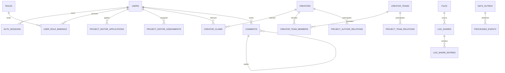

# 数据库健康审计

## 初始化模型

当前权威 Schema generation 为 85，采用开发期“空库直接初始化到最新结构”的策略。初始化器拒绝不匹配的旧 generation，不执行长期双读、双写或历史回填。这与当前允许重置开发数据库的要求一致。

Schema 语句在事务中执行；初始化末尾包含外键索引自动检查/补充。完成覆盖后的最终复跑从原后端 `.env` 安全加载远程测试库配置，显式设置 `DB_RESET_ON_START=false`，执行 `MCMODS_RUN_DB_INTEGRATION=1 go test ./... -count=1`；数据库、HTTP API、活动、反滥用和搜索集成包均通过，且未执行清库或开发数据库重置。

## 规模

静态解析结果：

- 259 个唯一 `CREATE TABLE` 声明；
- 300 个唯一索引名；
- 49 处 `ALTER TABLE`；
- 11 处初始化/规范化 `UPDATE`。

`ALTER TABLE` 不能一律视为残留：其中一部分用于循环外键和分模块 Schema 组合，具有实际价值。

远程测试数据库的只读系统目录快照见 [database/SCHEMA_CATALOG.md](database/SCHEMA_CATALOG.md)，包含每个表/列、NULL、默认值、全部约束、索引、非内部触发器、视图、序列、函数和统计估算行数。实测服务器为 PostgreSQL 18.0；当前库有 262 张表、2,450 列、3,469 个约束、978 个索引、137 个非内部触发器、3 个视图、119 个序列和 123 个函数。该数字包含主键/唯一索引及初始化自动生成的外键索引，因此不能与源码中 300 个显式唯一索引名直接等同。

## 认证与权限版本

权威结构包含：

- `users.auth_version`；
- `users.permission_version`；
- 持久化 runtime `rbac_version` / settings / project ACL 版本；
- 用户角色和直接权限变化触发 permission version；
- 密码/账号安全状态变化触发 auth version；
- 角色定义变化触发全局 RBAC version。

未发现普通项目角色变化递增 `auth_version` 的旧触发器。

## 项目权限关系

- 项目编辑员申请与正式授权关系分离。
- 作者认领只允许个人作者，一个作者最多一个审核通过认领。
- 团队成员引用 author，不直接引用 user。
- 项目作者/团队关系包含状态和是否授予权限。
- 有效访问通过数据库视图/查询派生，提交者不进入开发者权限。

图中的项目关系使用 `project_type + project_id` 多态目标；完整物理外键和约束以 Schema 目录为准。

完整语义审查发现，关系 Schema 本身具备状态和权限来源，但应用写法削弱了稳定审核语义：`project_authorship_handlers.go:L60-L145` 保存时删除项目全部作者/团队关系再插入，只保留无敏感权限编辑者遗漏的 approved 关系；pending/rejected 关系及原创建/审核时间会消失或重建。`creator_handlers.go:L885-L953` 对团队成员关系采用同类全删全插。应改为稳定关系键上的差异化 insert/update/revoke，并保留审核历史。

权限组线路升降级在事务外读取当前绑定，再在事务中全量替换线路角色；并发授权/撤销可能丢更新。该路径需要行锁、版本条件或串行化事务，而不是依赖后续 `permission_version` 触发器弥补。

## Outbox 与任务

存在 Outbox、processed events 和 dead-letter 结构，支持幂等与可追踪重试。通知源事件存在唯一性约束，能够抑制重复消费生成重复通知。

## 确认的 Schema 残留

基础迁移先创建旧形状的 `idx_nats_outbox_pending`（按 `created_at`），随后 infrastructure schema 添加状态/调度字段、回填数据、删除旧索引并按 `(available_at, id)` 重建。

Outbox正常claim事务会检查Scan、`rows.Err()`和Commit；但claim前的过期租约重置以及失败/死信状态写入均忽略数据库错误，指标仍提前记为成功转换（`OPS-009`）。这不会直接丢掉原始Outbox行，却会让记录停在publishing、延迟恢复并使监控与数据库事实分裂。状态转换结果、RowsAffected和死信insert必须成为可观察的权威提交结果。

在只支持空库初始化的 generation 85 中，这段“先建旧形状再迁移到当前形状”没有外部兼容价值，增加初始化跳转和维护成本。应把当前列、约束和索引直接合并进基础权威表定义，删除同一 generation 内的过渡更新。编号 `LEGACY-002`。

## 删除与保留语义

- 评论软删除，保留楼层。
- Mod 子资料、版本、模板和区块使用状态/归档字段，公共查询过滤。
- 安全、操作和权限历史没有因业务对象不可见而自动物理删除。
- 用户操作记录清理使用明确策略、预览/令牌和批量执行，累计统计与清理审计独立保留。

作者/团队外部导入是一个例外：导入“预览”在正式提交团队表单前已经创建/复用成员 author 并镜像头像。用户取消后会留下未关联审核记录和 OSS 对象，生命周期和额度边界不清晰；应使用带 TTL 临时对象或把持久化延迟到正式提交。

用户统计也存在两个事实同步缺陷。实时 `sync_user_content_creation_fact` 触发器仍读取旧 `created_by`，而四类项目已经使用 `submitted_by`，导致这些项目的创建事实触发器空转。手动 `userstats.Reconcile` 能从新字段补内容事实，但活动统计重算不写 totals 的 `action_counts`，并使用 `greatest` 只增不减，不能保证“校准后精确一致”。应把可清理原始事件前的累计基线与仍可精确重算的窗口分开建模。

目录治理状态也不是稳定事实：`catalog_entities.status='archived'` 会被后续资源、配方类型和配方导入的Upsert直接恢复为 `active`，没有记录归档来源或显式恢复动作。自动观察状态和人工公开状态应拆分，详见 `BUG-012`。

## 主要数据读写矩阵

| 表族 | 写入模块 | 读取模块 | 删除/归档 | 缓存/派生 | 增长风险 |
| --- | --- | --- | --- | --- | --- |
| users/auth_sessions/permissions | 认证、后台授权 | 中间件、RBAC | Session 过期/撤销 | Redis 权限缓存 | 中 |
| mods/simple projects/community posts | 创建、导入、审核 | 公开列表、详情、搜索 | 状态归档 | Typesense/热度 | 中 |
| project author/team/editor relations | 审核、高权限管理 | ProjectAccessResolver | 撤销/状态变化；当前部分保存全删全插 | ACL 版本缓存 | 低至中，审核历史风险 |
| comments/floors/reactions | 评论与互动 | 评论树、定位、统计 | 评论软删除 | 计数/通知 | 高 |
| notifications/actors/unread | 事件 Worker | 通知中心/未读汇总 | 保留策略 | 未读汇总派生 | 高 |
| user activity/audit logs | 中间件与管理操作 | 后台审计 | 策略化批量清理 | 累计统计；当前 action_counts 校准不完整 | 很高 |
| files/OSS bindings/scans | 上传/扫描/派生 | 下载、附件、后台 | 删除 Outbox | OSS/CDN | 高（字节） |
| log shares/entries | 日志处理 Worker | 短链、历史 | 到期/源删除 | 脱敏派生文件 | 高（字节） |
| task/outbox/dead-letter | 业务事务/Dispatcher | Worker/后台 | 完成保留/清理 | JetStream 为分发 | 高 |
| popularity/statistics/search | Worker/触发器聚合 | 列表、用户卡片 | 重算/保留 | 派生事实；项目创建事实触发器字段失配 | 中至高 |

最终确认 `user_chat_presence` 是没有任何运行时读写方的业务表；另有始终为空的导出 `report_snapshot` 和只写不读的封禁 `internal_note`。NATS 初始化过渡属于 Schema 残留而不是无用运行数据。通知正文、审核快照、结构化导出任务项和审计日志的重复是为了历史稳定/审计，不能按普通重复字段删除。还确认一条会产生孤儿数据的写路径（作者团队导入预览）以及一条会破坏稳定审核身份的关系重建路径，这些问题不应与有意快照混为一谈。

## 索引和约束结论

最终远程 PostgreSQL 集成复跑通过，包含外键前导索引质量检查。没有仅凭“列名相同”判定重复索引，也没有建议删除审计/历史索引。

完整阅读目录和Mod资料Schema后确认4个低价值重复索引：`resource_import_snapshots` 的两组唯一约束之后又创建相同列顺序的两个普通索引，`recipe_layout_templates(recipe_type_id,template_key)` 和 `mod_content_sections(version_id,parent_id,ordinal)` 也分别同时存在唯一约束索引和同列序普通索引。它们不增加新的查询前缀或排序能力，却增加目录导入和资料树写放大，编号 `DB-004`。

完整审计另确认第5个低价值重复索引：`idx_log_shares_owner_created(owner_user_id,created_at desc,id desc) where owner_user_id is not null` 已覆盖按非空owner执行的外键删除和用户历史查询，随后单列 `idx_log_shares_owner_fk(owner_user_id)` 不增加新的有效前缀。`schema_quality_integration_test.go` 又机械排除全部partial index并显式要求这个单列索引，测试反而固化写放大（`DB-008`/`TEST-027`）。应根据实际FK谓词接受等价partial前缀，并用 `EXPLAIN` 验证后删除重复项。

### 日桶依赖数据库会话时区（BUG-055）

活动批处理明确用 `(event_time at time zone 'UTC')::date`，但浏览计数、当前用户/审核统计、热度事件和初始30天刷新广泛使用 `current_date`；连接池没有设置PostgreSQL `TimeZone`。当远程测试/生产数据库会话时区不是UTC时，同一个时刻会进入不同日期，后台趋势、日活、浏览量和热度不能对齐。应在每条应用连接固定UTC，并统一以UTC边界计算日期；用户时区只用于展示。

项目文件Schema还为每个文件注册一条 `public_routes` 记录，canonical path 固定为 `/api/v1/project-files/{id}/download`，但当前仓库没有注册该路由；真实下载必须携带项目类型、项目ID和来源。软删除文件也不会删除该route，持续累积不可达身份/路径记录，见 `DB-005`。

项目更新事件把内部 `content_revisions.id` 转成text保存且不设外键；所有当前写入方本来就是int64或NULL，这个转换没有协议价值并削弱可追溯约束，见 `MAP-006`。通知幂等索引为 `(recipient_id,project_update_event_id)`，但Worker每批按 `project_update_event_id` 单列COUNT，缺少反向索引，见 `PERF-025`。

## 尚未验证

- 没有生产数据量和查询计划，无法确认所有联合索引顺序最优。
- 没有执行真实大表分区、vacuum/bloat、慢查询和连接池观测。
- 未执行灾难恢复、备份还原和跨版本滚动发布测试。

## Mod 导入事实与生命周期

- `catalog_import_packages.sha256` 是全局唯一事实，但记录中的 `archive_file_id/uploaded_by` 会在SHA冲突时被覆盖；既有job继续引用同一个package ID，破坏内容寻址记录不可变性，见 `SEC-009`。
- 任务恢复和重试只更新 `catalog_import_jobs.status='queued'`，没有与新Outbox事件形成原子事务，导致数据库任务事实与可执行事件分裂，见 `BUG-019`。
- 导入投影对新revision只做Upsert，不对同来源旧集合做差异撤销；`mod_resource_version_details` 与活动布局因此可能长期保存上游已删除事实，见 `BUG-018`。
- 媒体/语言包对象和 `oss_files` 分批提交早于最终导入事务，失败清理没有对象清单，形成无引用派生存储，见 `OPS-003`。
- 资料板块和布局的ordinal采用max+1，缺少version级串行化；数据库唯一约束会把并发冲突变成失败或静默跳过，见 `BUG-017`。

## 建议

1. 合并 generation 85 内的 NATS 过渡 Schema。
2. 用接近生产规模的数据运行关键列表和权限查询的 `EXPLAIN ANALYZE`。
3. 将空库初始化、权限种子和关键约束集成测试纳入 CI。
4. 发布后改用追加迁移，禁止重写已经生产执行的迁移历史。

## 证据化总体评价

| 维度 | 评价 | 主要证据 |
| --- | --- | --- |
| 数据完整性 | 需改进 | 约束和远程集成测试基础良好；关系全删全插和导入预览孤儿写入需要修复 |
| 规范化 | 基本健康 | 权限、作者团队、评论楼层和版本关系使用正式关系表 |
| 索引 | 基本健康，待规模验证 | 300 个显式唯一索引名；已确认5个低价值重复索引及1个初始化过渡索引 |
| 可扩展性 | 需改进 | 无生产规模查询计划；任务/日志增长策略需实测 |
| 清理和归档 | 基本健康 | 归档、过期任务和用户操作记录策略存在 |
| 事务安全 | 需改进 | 评论计数器、Outbox 基础良好；权限组线路事务外快照可并发丢更新；JetStream 未实测 |
| 重复数据 | 未发现高危双写 | 通知渲染快照、统计和搜索属于有意派生数据 |
| 隐私和保留 | 基本健康 | 文件、日志和审计数据生命周期分离；需生产策略复核 |

## Mod资料模板引用完整性

`mod_resource_version_details.entry_type_code` 是持久化业务事实，但没有外键或版本化定义指向模板JSON内部的条目类型。后台内建模板更新只比较仍存在类型的字段签名，自定义模板更新完全不比较旧Schema；两者都不查询引用。删除或改型不会清理/迁移详情行，随后业务解析返回引用错误（`BUG-024`）。这类JSON内部标识无法使用普通外键时，至少需要事务级引用守卫；更稳妥的是把模板Schema版本化，让历史详情绑定不可变版本。

`mod_content_sections` 冗余保存 `version_id`，但父FK只指向section主键，没有复合约束保证父子版本相同；触发器仅验证被修改行的新父节点，根节点直接放行，也不会检查既有孩子。旧单板块PUT因此能把父行移到新版本而留下旧版本子树和placement（`BUG-025`）。此不变量不能只靠当前行触发器，API应禁止非空子树移动或使用受锁的整树操作。
# 简单项目关系的写放大与身份稳定性

`content_creator_bindings` 具有稳定公开ID和审批元数据，但简单项目发布路径以“整表关系删除后逐条重插”同步。未变化关系因此更换公开ID、创建时间、审批人和审批时间；同时触发全局项目ACL版本与搜索Outbox。关系表设计本身支持稳定记录，当前应用写法没有利用该能力。应改为按 `(subject_type, subject_id, creator_id, role_id)` 差异更新，并保留无变化行，见 `BUG-028`、`PERF-019`。

# 自动镜像文件唯一性

`mirrored_project_files` 同时有全局 `unique(source_type,external_file_id)` 和 `unique(source_type,file_sha256,byte_size)`，两者都不包含项目。Worker只按外部文件ID预查；另一外部文件ID若内容相同，会先上传OSS再在内容唯一约束处失败，且不会复用旧镜像或建立当前项目关系。这会阻止合法重发版/共享文件并产生孤儿对象（`DB-006`）。内容去重应拆为内容对象与项目/外部文件引用表，或把唯一范围改为真实关系身份。

`seed_crawler_candidates.run_id` 只在首次insert写入；后续发现同一外部项目的upsert更新下载量/payload/updated_at，却不更新run_id。候选详情因此永久指向最早发现它的run，而当前payload可能来自后续任意run，审计来源自相矛盾（`BUG-041`）。若需发现历史应增加候选观察表；若只保留当前状态，应明确更新 `last_seen_run_id`，不要复用含义不准确的单一run_id。

# 私聊Schema残留与索引错配

`user_chat_presence` 在Schema中具有用户、会话、过期时间和更新时间，但全仓没有任何读写；当前聊天活跃状态的权威实现是 `querycache.Cache` 的Redis键和有界时间本地回退。该表属于确认无用存储（`DB-007`/`DEAD-006`），开发阶段应直接从权威Schema移除，而不是保留第二套未同步事实。

`direct_messages` 的主要列表查询按 `(conversation_id,id desc)` 排序/游标，现有索引却是 `(conversation_id,created_at desc)`；会话未读按 `(recipient_id,conversation_id) where read_at is null` 过滤，现有 `(recipient_id,read_at,created_at desc)` 也不能覆盖每会话相关COUNT。需要以真实数据执行计划确认并按实际谓词补索引，见 `PERF-030`。

# 运行与审计日志生命周期

`logs.retention` 默认声明启用，但全仓只有更新配置Handler调用 `cleanupLogs`；没有定时Worker读取该配置。数据库日志不会按声明周期自动清理，管理员每次保存设置反而在同一HTTP请求里立即执行多张表的无界DELETE（`BUG-052`、`PERF-033`）。每条DELETE错误又被忽略，返回的 `deleted` map缺项但仍是200，无法区分“没有过期记录”和“清理失败”。应复用已有活动日志的租约、分批和独立清理审计框架，或者为这些专用日志建立同等可靠的调度器，而不是保留第二套只保存配置的伪自动系统。

日志列表共同使用 `querySimpleRowsWithContext`；Query失败返回空数组、单行解码失败直接跳过、最终 `rows.Err()` 不检查。该辅助函数先前已导致自动化后台把故障显示成空任务（`ARCH-013`），现在确认管理员安全/权限/登录/上传日志也具有相同行为：数据库故障会被错误显示为“0条日志”，降低事件响应可信度。

# 热度模型的单一owner投影不符合多开发者关系

`content_target_owner_id` 从 `effective_project_access` 的全部developer中按用户ID只取第一人，并把这个派生值当作项目唯一owner。评分、收藏、评论和独立访客只排除这一人；同一项目其他已认证作者/团队开发者的自有交互仍进入热度。当前权限模型明确允许多个直接作者和多个团队成员同时获得developer访问，因此该标量函数既丢失关系基数，又使指标依赖最小用户ID（`BUG-057`、`MAP-007`）。应以集合型排除关系参与查询，不能把多值授权关系投影成单个owner。

`refresh_content_popularity` 还声明并计算 `direct_commenters`、`child_commenters`，最终总评论者却由另一条UNION查询重新计算，两个变量没有任何读取方（`DEAD-008`）。

# 内容浏览维度缺少权威范围与生命周期

`content_project_pages` 的主键能防止同一路由/同一哈希重复，但页面身份完全来自公开请求提交的任意 `pageKey`，没有页面类型外键、有限注册表或清理时间；每个新值都会成为热度公式的永久分母事实。`content_unique_views` 同样永久保存每项目访问者哈希与可选用户ID，并被公开接口用于显示最近访问者，没有隐私状态关联或保留策略。前者造成无界基数和指标操纵（`SEC-023`），后者造成浏览隐私泄露（`SEC-022`）。应把页面维度绑定服务端路由事实，对访客事实明确用途、保留期限、公开授权和删除流程。

`content_stats_refresh_queue` 与 `comment_heat_refresh_queue` 使用锁租约和attempt保证可重试，但Schema/Worker没有failed或dead-letter状态，也没有最大attempt检查。永久违反业务不变量的行会无限回到可用队列；重试UPDATE本身失败时只留下日志且没有可靠恢复记录（`OPS-010`）。

# 搜索投影代次与重建没有数据库级所有权

`search_index_queue` 的单行合并和 `updated_at` 比较能保护普通增量任务：处理期间的新事件不会被旧任务删除。但 `search_index_state` 只记录最终集合名/Schema版本，不记录重建代次、快照水位或全局租约。另一个实例可以在全量快照加载期间消费并删除更新队列，把变更应用到即将被替换的旧别名；新集合切换后缺少该变更且队列已空（`BUG-058`）。不同二进制Schema版本也会反复覆盖同一状态/别名（`OPS-011`）。需要数据库级单一重建所有者、明确快照水位/重放边界和版本发布兼容策略。

队列表虽然保存attempt和last_error，但Worker没有最大attempt或失败状态，complete/retry SQL错误均被忽略。永久坏文档会无限轮询；应与其他可靠任务统一失败、死信和人工重放模型。

# 用户角色绑定缺少多来源表达能力

`user_role_bindings` 以 `(user_id,role_id)` 为主键，只保存context/expiry，不保存稳定 `source_type/source_id`，因此同一角色无法同时表达手工授权与等级轨道等派生来源。`SyncTrackRole` 只能删除该轨道的全部角色ID，直接抹去管理员手工配置（`BUG-059`）。这与封禁角色遗留问题 `BUG-002` 属于同一建模缺口：授权事实需要可追踪来源集合，最终权限取有效来源并集，撤销和自动同步只能删除自身来源。

后台权限保存进一步暴露同一Schema缺陷：全删`user_role_bindings`后只插回`user_id/role_id`，把已有`expires_at/context`全部归零（`SEC-044`）。`user_permissions.context`虽从Schema写入、API读回，却完全不参与权限解析，前端类型也不保存它（`MAP-011`）；它目前只是看似有作用的重复事实字段。角色`parents`又是无外键数组，默认角色在JSON设置中引用；`deleteRole`只清绑定和权限，不校验这些依赖，能留下缺失父级/默认码和被级联挖空的轨道（`BUG-122`）。

`task_definitions.condition/rewards` 使用JSONB，但Schema只保证对象形状，读取端对Go结构反序列化失败又静默跳过/置零；损坏奖励仍会写入 `user_task_progress.rewarded_at`（`BUG-060`、`ARCH-014`）。应在写入边界验证Schema或用约束更强的关系字段表达核心金额/目标，读取失败不得进入正常状态机。

# 基础设施统计和死信管理的数据库边界

`infrastructureMetrics` 的Outbox状态统计和死信COUNT共用一次查询，但调用方忽略整个查询错误并返回结构体零值（`ARCH-015`）。数据库不可用、表结构错误或查询超时时，后台会显示pending/failed/dead均为0；运维事实和真实数据库状态相反。该读取应返回错误/明确unknown状态，不能以零替代故障。

死信重放使用事务内 `FOR UPDATE` 锁定目标行，按aggregate/event恢复Outbox并记录审计，原子性边界合理；但管理查询只暴露最新100条（`PERF-038`）。必须增加稳定游标，才能使表中的历史未解决事实真正可运维。

# Minecraft版本配置的事实完整性

Minecraft版本、加载器支持范围、同步来源和状态全部嵌在单个 `system_settings.value` JSONB中，读取端任何数据库或反序列化错误都静默换成硬编码默认值（`ARCH-016`）。因此数据库事实损坏不会进入错误状态，公开API反而返回看似完整但错误的兼容目录。加载器code也没有数据库唯一约束，应用规范化又只做大小写敏感去重（`BUG-064`）。至少应在保存边界做大小写无关唯一校验、为配置引入可观测的版本/校验状态，并将具体加载器发布版本作为可复用快照，而不是由MRPack请求即时重算。

# 收藏夹导出任务的历史与对象一致性

`favorite_modpack_export_tasks.collection_id` 对收藏夹设置 `ON DELETE CASCADE`。任务虽然保存了名称、设置、计数和逐项结果快照，但删除源收藏夹会物理删除运行中任务及所有历史报告（`BUG-068`）；这与“导出时冻结快照、临时文件过期后报告仍保留”的业务含义冲突。任务应保留可空来源引用或独立不可变来源快照，收藏夹删除不得级联删除报告。

`report_snapshot` 具有JSONB默认值，但Handler、Worker和查询均未写入或读取，是当前确认的无用存储（`DEAD-011`）。`allow_compatible_only` 虽在创建时写入，却没有被历史或详情查询返回（`BUG-071`）。Worker又先写OSS派生文件、后单独更新任务；失败没有对象墓碑或补偿队列，可能产生孤儿对象（`OPS-013`）。
## 蓝图任务、派生文件与查询事实

- `blueprint_jobs` 只有queued/processing/completed/failed和普通队列索引，没有租约所有者、租约到期、下次重试或死信边界；processing任务无法由启动扫描恢复（`OPS-014`）。
- 蓝图规范文件、封面和转换variant在OSS写入后才提交数据库，失败没有持久补偿；部分生成文件ID被直接丢弃，数据库不能完整枚举存储事实（`OPS-015`）。
- 重试主体状态更新与任务/Outbox不在同一事务，上传规范化还复制任务INSERT并绕开Outbox（`BUG-078`、`LEGACY-013`）。
- 材料revision查询应按当前namespace集合限制；当前全站 `distinct on` 会把导入目录规模引入每次蓝图详情（`PERF-043`）。

## OSS上传原子性

- 用户额度由运行时SUM推导，没有额度预留表；查询失败放开额度且并发检查可超额（`SEC-028`、`PERF-044`）。
- `oss_files` 与 `report_evidence` 分两次提交；第二次失败后现有幂等分支无法恢复举报scope（`BUG-080`）。
- 上传前创建的蓝图主体没有上传会话到期事实，预签名失败或放弃会遗留uploading状态（`BUG-079`）。
- 删除Outbox把对象路径作为永久唯一事实，completed行不会因同Key新对象而重开；确定性生成Key复用后第二个对象无法删除（`BUG-081`）。
- 分片上传没有会话表、到期事实或Abort清理；对象存储费用依赖仓库外Bucket策略（`OPS-018`）。
- 生成对象先写OSS再登记数据库，登记失败没有补偿墓碑，形成无法枚举的孤儿（`ARCH-021`）。

## 评论一致性与生命周期

- 评论楼层计数器和闭包路径在同一事务中创建，顶级楼层原子递增且回复不占楼层，这部分边界正确。
- 日志附件识别却发生在评论事务提交之后，状态、分享和绑定分多条语句且无任务事实；失败不可可靠恢复（`BUG-082`）。
- 评论软删除不解除附件绑定，序列化仍返回附件元数据和日志短链（`BUG-083`）。
- 编辑锁只串行化写入而不比较客户端基线，仍会产生最后写入者静默覆盖（`BUG-084`）。
- 活动插眼上限由COUNT推导且无原子预留，并发无法保证2000条约束（`SEC-032`）。

## 皮肤内容寻址Blob的归属

`skin_texture_blobs` 以内容哈希全站复用，但对应 `oss_files` 必须有一个uploader，当前选择首次上传用户并同时记source/stored bytes。这个用户既承担原文件又承担全站共享派生PNG；外键restrict和skin软删除又让该行无法按普通用户生命周期回收（`BUG-088`）。共享派生对象应是系统级存储事实，使用引用/GC而不是个人文件归属；OSS先写后记库仍受 `ARCH-021` 的孤儿窗口影响。

## 评分刷新和收藏约束

评分表的行级触发器对INSERT/UPDATE/DELETE都原子调用可合并刷新队列，删除路径不会漏刷新；Handler更新路径的第二次入队属于冗余而非缺失（`MAP-010`）。收藏关系有目标外键和集合内唯一约束，但没有“可收藏目标类型”、目标公开状态、单用户集合数或条目总数约束；可见性必须由写入服务校验，存量上限至少需要原子额度事实或受锁计数。

## 社区内容修订与引用

社区内容修订使用聚合级advisory lock分配修订号并禁止同时存在两个待审请求；悬赏冻结、退款、奖励和问题解决也在同一事务中锁定问题/悬赏行，单一路径的资产原子性较完整。但免审更新在事务外读取 `published_revision_id`，取得聚合锁后没有比较该基线，两个并发免审更新会依次发布且后者静默覆盖前者（`BUG-090`）。项目引用外键只证明ID存在于 `public_routes`，不表达当前可见性；软删除/隐藏不会删除路由，读取必须动态复核（`SEC-037`）。

## 内容修订历史与AI任务事实

`content_revisions`保存完整snapshot，`content_change_items`又保存差异；对象差异逐叶子写行，数组变化则把完整before/after数组再次写入，形成可观的重复事实与写放大（`PERF-055`）。这些表上的历史读取没有分页（`PERF-054`），长期活跃对象会把全量历史一次返回。

通用AI任务入口能把`ai_tasks`与Outbox放在同一事务；内容本地化专用入口则提交任务后直接NATS，未写Outbox，失败还直接标为terminal failed。数据库虽然保存任务事实，却没有queued/failed恢复扫描把它重新投递，任务记录并未真正承担可靠事实来源职责（`LEGACY-019`、`OPS-019`）。

## 经济守恒和等级轨道

余额行锁、非负CHECK与同事务流水能阻止普通竞态和负余额，但应用层在进入这些约束前使用未检查int64乘加。转账的负税回绕仍可产生两个合法非负余额，数据库约束不会发现货币凭空增加（`SEC-039`）。热度提升的`sequence_no`没有唯一约束或对象级计数器，`COUNT + INSERT`并发产生重复序号和相同衰减值（`BUG-095`）。

等级配置直接全表锁定并逐用户维护无来源的`user_role_bindings`；切换轨道不清理旧轨道（`SEC-040`），同轨道同步又继承`BUG-059`的手工授权误删风险。需要把派生角色来源建模为可重算事实，而不是在通用绑定表中全删全插。

## 表情包关系与删除一致性

- `stickers.image_file_id`只有外键、没有唯一约束或共享引用模型，但应用层按“每个表情独占文件”直接归档OSS对象，Schema与生命周期假设不一致（`BUG-098`）。
- Markdown Token没有结构化引用表，删除保护靠跨表子串扫描，既遗漏历史/本地化事实又无法用外键或事务阻止检查后的新引用（`BUG-099`、`BUG-100`、`PERF-057`）。
- 删除空表情包的预检发生在事务外。并发创建表情先取得父表外键锁后，删除可在等待后级联掉刚提交的表情，而关联OSS文件不会被归档，产生“创建成功但记录消失”的孤儿文件（`BUG-100`）。

## 举报与封禁状态事实

- 举报本体、单份快照、审核记录、处置记录和证据表具有外键/唯一约束；同一举报人的同一目标最多一个pending/in_review举报，领取用条件UPDATE，基础并发边界合理。
- 处置事务没有数据库或应用约束把`resolved_invalid`与“无删除、无封禁动作”绑定。当前Handler可在同一事务写入无效结论和有效惩罚事实，报告状态与`moderation_actions`/`ban_records`矛盾（`BUG-110`）。
- `ban_records`以`status='active'`部分唯一索引阻止同一用户多个生效封禁；`MaintenanceWorker.expireBans`存在且使用`FOR UPDATE SKIP LOCKED`分批更新expired、删除banned角色。先前“没有到期更新者”的中间结论已修正。但创建端允许已过去的`ends_at`（`BUG-111`），维护Worker又把封禁排在举报证据清理之后并与所有任务共用30秒预算，长积压时部分唯一事实的释放可持续延迟（`OPS-020`）。
- `user_drafts`对活跃 `(user_id,draft_key)` 有正确部分唯一约束，payload也用CHECK限定为JSON对象；但表结构与Handler都没有用户条数/字节配额，已完成记录不受活跃唯一索引限制。这30天持久JSONB存储可被普通账号无界增长（`SEC-043`），并且无界列表会在大用户上排序全部未过期行（`PERF-061`）。
- `internal_note`被持久保存，且种子声明`ban.view_internal`用于读取内部备注；唯一GET却复用公共选择列，参数`internal`没有行为，仓库内无任何读取该列的路径（`DEAD-013`）。这是一项当前只写不读的低价值/不可达数据存储。
